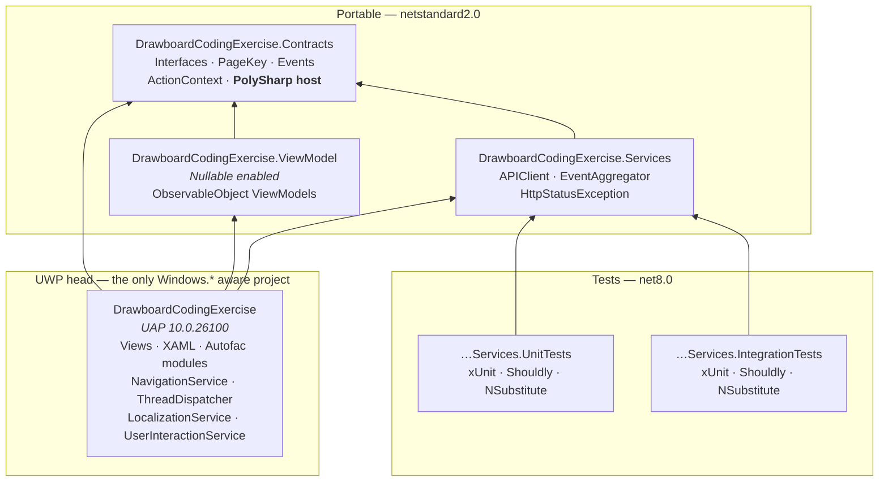
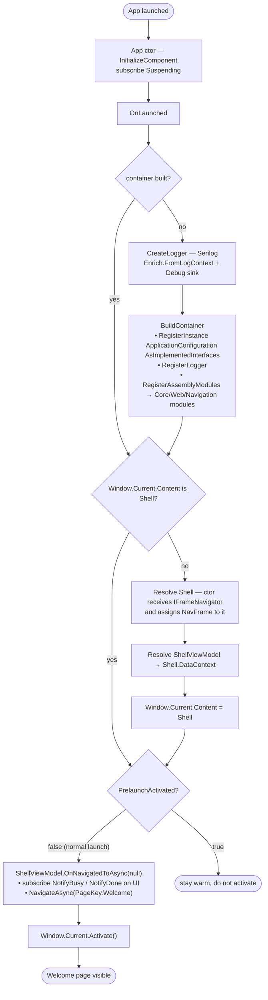
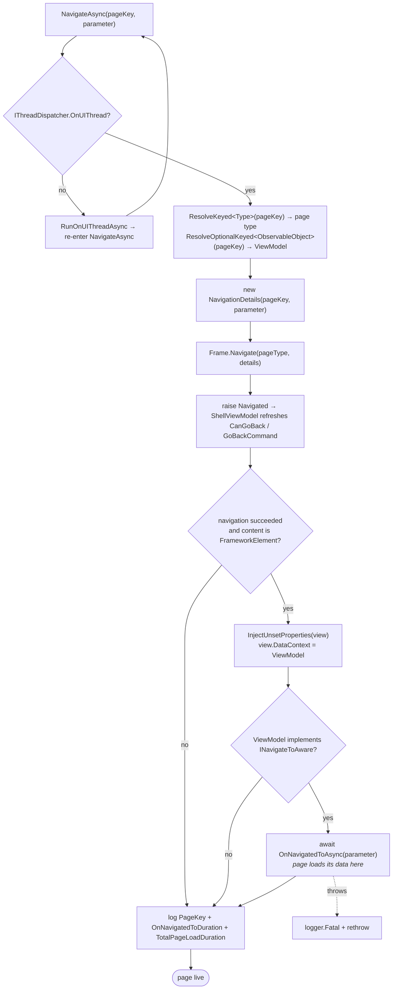
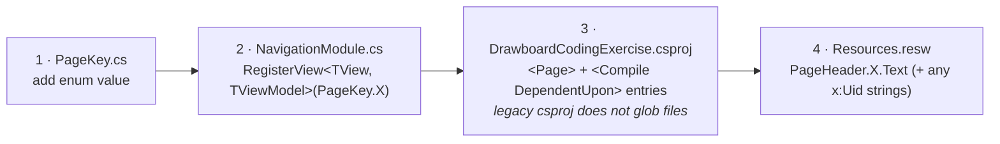
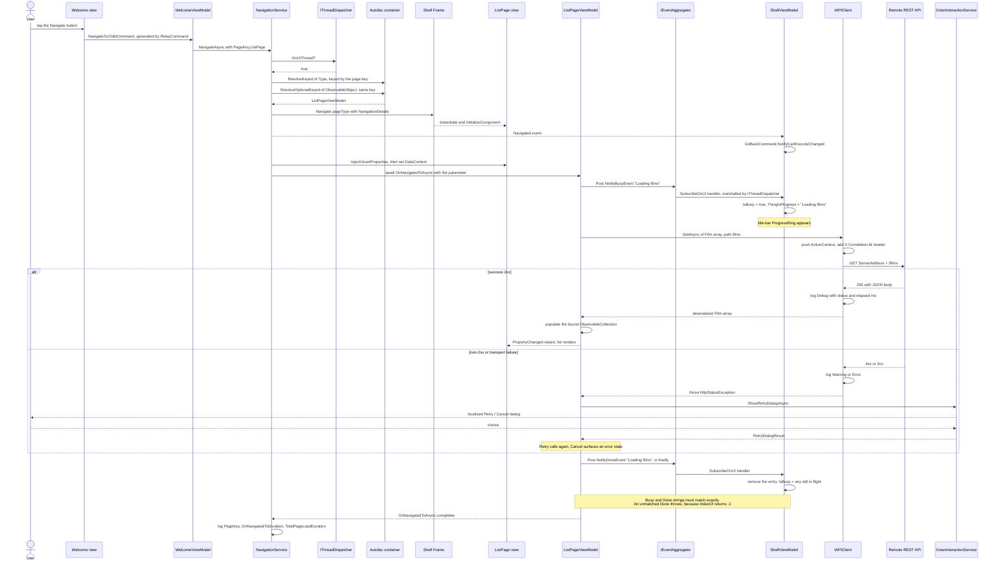
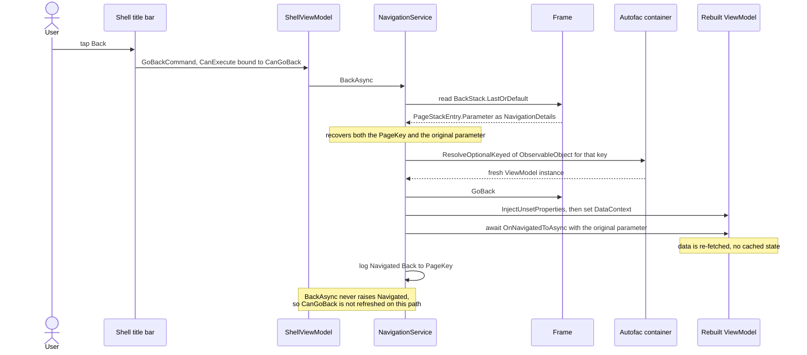
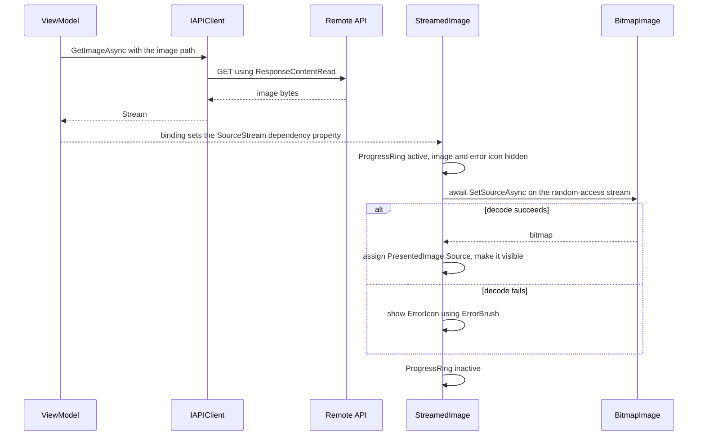

# Architecture Reference — Drawboard UWP Coding Exercise

A technical description of the **scaffold as supplied**: what shipped in it, how the pieces fit, which patterns it applies, how it is tested, and the runtime flows that matter.

> **This describes the starting point, not the delivered solution.** It was written before implementation and is kept unrevised, because knowing what was inherited is what makes the changes legible. The `Welcome` and `PageA` pages it describes have since been replaced, the event aggregator rewritten, and the base address pointed at a real API.
>
> For the delivered state see [SOLUTION.md](SOLUTION.md); for every change with line references, [CHANGES.md](CHANGES.md). Three defects documented below as scaffold behaviour were subsequently fixed: the unmatched-completion crash (§Busy indicator), the event aggregator's ordering (§`IEventAggregator`), and the placeholder base address (§Calling the API).

- **Solution:** [DrawboardCodingExercise.slnx](DrawboardCodingExercise.slnx) (5 projects + 2 test projects)
- **UI platform:** UWP / XAML, `TargetPlatformVersion` 10.0.26100.0, `TargetPlatformMinVersion` 10.0.18362.0
- **Supported platforms:** x64, ARM64 (no AnyCPU/x86 solution configuration)
- **Runtime constraint:** UWP's .NET runtime is roughly .NET Core 2.1; modern language features are unlocked by PolySharp source generation rather than a newer BCL
- **Build/test commands and day-to-day gotchas:** [CLAUDE.md](CLAUDE.md)

---

## 1. What this repository is

This is Drawboard's UWP interview scaffold — a deliberately minimal but production-shaped MVVM application containing the same infrastructure services their shipping products use (navigation, threading, localization, eventing, REST access, logging, DI). It is not a finished app: it boots into a `Welcome` page with a single button that navigates to a placeholder `PageA` which fakes five seconds of work.

The exercise defined in [README.md](README.md) is to extend it into a two-page, API-backed app, choosing one of:

| Option | API | Page 1 | Page 2 |
|---|---|---|---|
| 1 | [swapi.info](https://swapi.info/) | All films — title + episode number | Selected film: title, episode, release date, director, producer + a related list (characters/planets/starships/vehicles/species). Bonus: opening crawl |
| 2 | [MET Collection](https://metmuseum.github.io/) | Departments — display name | Objects in that department: title, culture, period, thumbnail (first 50). Bonus: all objects |

The API must be called directly through the supplied `IAPIClient`; wrapper libraries for these specific APIs are out of scope by instruction. Evaluation weights design principles, testability, extensibility, automated tests, error reporting to the user, and adherence to UWP idiom.

---

## 2. Project structure and dependency direction

Dependencies point strictly inward. Only the UWP head project references `Windows.*` types, which is precisely what keeps ViewModels and services unit-testable on plain .NET.

| Project | TFM | Responsibility |
|---|---|---|
| `.Contracts` | netstandard2.0 | Abstractions shared by everything: `INavigationService`, `INavigateToAware`, `IProvidePageHeader`, `IThreadDispatcher`, `IEventAggregator`, `ILocalizationService`, `IUserInteractionService`, the `PageKey` enum, the busy/done event records, and `ActionContext`. Hosts PolySharp with `PolySharpUsePublicAccessibilityForGeneratedTypes=True`, so `record`, `init`, ranges and friends are usable from every referencing netstandard2.0 project. |
| `.Services` | netstandard2.0 | Platform-free implementations: `APIClient` and `EventAggregator`. This is the layer the API-facing code for the exercise belongs in. |
| `.ViewModel` | netstandard2.0, `Nullable` enabled | ViewModels built on CommunityToolkit.Mvvm `ObservableObject`, plus a design-time ViewModel for the XAML designer. |
| `DrawboardCodingExercise` | UAP | Views, value converters, controls, the Autofac module set, and every service whose implementation needs `Windows.*`. Legacy non-SDK csproj — files must be listed explicitly. |
| `.Services.UnitTests` / `.Services.IntegrationTests` | net8.0 | Test harnesses (see §5). |

### Key packages

`Autofac` 8.2 + `AutofacSerilogIntegration` (DI, logger injection) · `CommunityToolkit.Mvvm` 8.4 (MVVM source generators) · `Newtonsoft.Json` 13 (serialization) · `Serilog` 4.2 + Debug sink (structured logging) · `System.Reactive` 6 (`CompositeDisposable`; available for wider use) · `System.Threading.Tasks.Dataflow` (event aggregator transport) · `PolySharp` 1.14 (language-feature polyfills) · `Microsoft.Xaml.Behaviors.Uwp.Managed` · `JetBrains.Annotations` · `xUnit` / `Shouldly` / `NSubstitute` / `coverlet.collector`.

---

## 3. Feature inventory

Everything below is already implemented and available to build on.

### Navigation service — `INavigationService` / `IFrameNavigator`
Navigate-by-key over a UWP `Frame`. `NavigateAsync(PageKey, object parameter = null)` resolves the view `Type` and its ViewModel from the container, drives the frame, wires `DataContext`, and awaits the ViewModel's `OnNavigatedToAsync`. `BackAsync()` replays the original navigation parameter recorded in the frame's back stack. Exposes `CanGoBack` and a `Navigated` event so the shell can refresh its back button — note the event fires on forward navigation only (see §6.2). Registered `SingleInstance`; `IFrameNavigator` is the write-only seam the `Shell` uses to hand over its `Frame`.

### Thread dispatcher — `IThreadDispatcher`
Wraps `CoreApplication.MainView.Dispatcher` behind a netstandard2.0-visible interface: `RunOnUIThreadAsync(Func<Task>)`, `FireOnUIAndForget(Action)` (logs and swallows failures), and `OnUIThread`. Both run inline when already on the UI thread. This is what allows ViewModels to marshal to the UI without referencing UWP.

### Event aggregator — `IEventAggregator`
Decoupled pub/sub over a TPL Dataflow `BroadcastBlock<object>`, with type-filtered `LinkTo` subscriptions. Provides `Post<T>`, `Subscribe<T>`, `Subscribe<T>` with a predicate filter, and `SubscribeOnUI<T>` (handler marshalled through `IThreadDispatcher`). Subscriptions return `IDisposable`. Registered `SingleInstance`.

### Progress / busy reporting
`NotifyBusyEvent(string Event)` and `NotifyDoneEvent(string Event)` records. `ShellViewModel` subscribes on the UI thread, maintains a list of in-flight operations, and surfaces `IsBusy` + `ThingInProgress` to the title bar's `ProgressRing`. **The Busy and Done strings must be identical** — the Done handler does `IndexOf` then `RemoveAt`, so an unmatched Done throws. Pair them with `try/finally`.

### API client — `IAPIClient`
`GetAsync<TResponse>`, `PostAsync<TRequest,TResponse>`, `GetImageAsync` (returns a `Stream`). One static `HttpClient` per Microsoft guidance, unauthenticated, `Accept: application/json`. Paths are resolved against `IAPISettings.ServerAddress`. Every non-2xx response throws `HttpStatusException` carrying the `HttpStatusCode`. Each call opens an `ActionContext`, sends the correlation id as `X-Correlation-Id`, and emits Serilog entries with method, path, status and elapsed ms — at `Debug` for 2xx, `Warning` for 3xx/4xx, `Error` otherwise.

### Correlation context — `ActionContext`
`AsyncLocal<string>` correlation id pushed into Serilog's `LogContext`. Nested pushes are no-ops that keep one id for a whole logical operation, so client logs can be matched against server logs.

### Localization — `ILocalizationService`
Key-based lookup into [Strings/en/Resources.resw](DrawboardCodingExercise/Strings/en/Resources.resw). Resource names use dots (`Errors.Retry`); the service rewrites them to the `ResourceLoader`'s slash form and applies `string.Format` parameters. Missing keys render visibly as `[Key]` rather than throwing. XAML uses `x:Uid` for static text.

### User interaction — `IUserInteractionService`
`ShowRetryDialogAsync()` shows a localized Retry/Cancel `MessageDialog` and returns `RetryDialogResult`. This is the intended reaction to a failed API call.

### Page headers — `IProvidePageHeader`
A ViewModel returns a *resource-key fragment*, not display text. `PageHeaderValueConverter` resolves `PageHeader/{PageHeader}/Text` from the resw and falls back to a visible `[PageHeader.X.Text]` marker. The shell binds it off the frame's live content, so the title tracks navigation automatically.

### `StreamedImage` control
`UserControl` with a `SourceStream` dependency property (plus `ErrorBrush`). Decodes a `Stream` into a `BitmapImage` while showing a `ProgressRing`, and swaps in a `Cancel` `SymbolIcon` if decoding fails. Designed to pair with `IAPIClient.GetImageAsync` for remote thumbnails.

### Logging
Serilog configured in `App` with `Enrich.FromLogContext()` and a Debug sink, registered into Autofac via `RegisterLogger`, so any component can constructor-inject `ILogger`.

### Value converters
`BoolToVisibilityConverter` and `PageHeaderValueConverter`, declared as `Page.Resources` in the shell.

### Design-time support
`DesignTimeShellViewModel` passes nulls to the base constructor and is bound via `d:DataContext`/`d:DesignInstance`, so the XAML designer can render the shell without a container.

---

## 4. Design patterns in use

| Pattern | Where | Notes |
|---|---|---|
| **MVVM** | `.ViewModel` + `View/` | Views are near-empty code-behind; state and commands live in `ObservableObject` ViewModels bound through `DataContext`. |
| **Source-generated observable/command** | `[ObservableProperty]`, `[RelayCommand]` | CommunityToolkit.Mvvm generates `INotifyPropertyChanged` plumbing and `IRelayCommand` wrappers; ViewModels must be `partial`. `CanExecute = nameof(...)` + `NotifyCanExecuteChanged()` drives command enablement. |
| **Dependency Injection / IoC** | Autofac container in `App` | Constructor injection throughout; `InjectUnsetProperties` provides property injection for views, which cannot take constructor arguments during frame navigation. |
| **Module pattern (composition root)** | [Module/](DrawboardCodingExercise/Module/) | `CoreServicesModule`, `WebServicesModule`, `NavigationModule` are `Autofac.Module`s discovered by `RegisterAssemblyModules(typeof(App).Assembly)`. Adding a module requires no registration edit. |
| **Service locator, narrowly scoped** | `NavigationService` holds `IComponentContext` | Deliberate: page types and ViewModels can only be resolved at navigation time by key. Confined to the navigation seam rather than used app-wide. |
| **Keyed registration / abstract factory** | `MvvmViewExtensions.RegisterView<TView,TViewModel>(PageKey)` | Registers the ViewModel `Keyed<ObservableObject>(pageKey)` and the view `Type` `Keyed<Type>(pageKey)` — one lookup key yields both halves of a page. |
| **Publish/subscribe (event aggregator)** | `EventAggregator` | Removes direct references between publishers and subscribers; `ShellViewModel` reacts to progress events raised by pages it knows nothing about. |
| **Mediator-ish navigation** | `NavigationService` | ViewModels request a `PageKey`; they never touch `Frame`, page types, or each other. |
| **Adapter / facade** | `ThreadDispatcher`, `LocalizationService`, `UserInteractionService`, `APIClient` | Each wraps a platform or transport concern behind a netstandard2.0 interface so portable code stays platform-free and mockable. |
| **Repository-shaped seam (to be added)** | `IAPIClient` | The client is the transport; the exercise expects a domain-facing service in `.Services` over it, not raw `IAPIClient` calls from ViewModels. |
| **Template method / lifecycle hook** | `INavigateToAware`, `IProvidePageHeader` | Opt-in interfaces the framework probes for after navigation, instead of a mandatory base class. |
| **Dispose / RAII scopes** | `CompositeDisposable`, `ActionContext.ActionDisposable`, `LogContext.PushProperty` | Subscriptions and ambient context are tied to `using`/dispose lifetimes. |
| **Value object** | `record NotifyBusyEvent` / `NotifyDoneEvent`, `NavigationDetails` | Records via PolySharp; `NavigationDetails` hand-implements full structural equality for back-stack comparison. |
| **Dependency property + attached behaviour** | `StreamedImage` | `SourceStream` change callback triggers async decode with progress and error states. |
| **Converter (adapter for binding)** | `ValueConverters/` | One-way converters; `ConvertBack` throws `NotSupportedException` by design. |
| **Options / settings abstraction** | `IAPISettings` ← `ApplicationConfiguration` | Registered `AsImplementedInterfaces` from a single instance; currently holds the placeholder base address `https://some.api.com/`. |
| **Correlation / ambient context** | `ActionContext` | `AsyncLocal` id flowed into logs and outbound headers. |
| **Structured logging with enrichment** | Serilog `ForContext` / `LogContext` | Message templates carry named properties (`{PageKey}`, `{Elapsed}`) rather than interpolated strings. |

### Layering rules that fall out of this

1. ViewModels depend on `.Contracts` abstractions only — never on `Windows.*`, never on `Frame`, never on `CoreDispatcher`.
2. UI-thread marshalling goes through `IThreadDispatcher`.
3. HTTP and JSON stay inside `.Services`; ViewModels consume domain-shaped results.
4. Anything the head project implements gets an interface in `.Contracts` first, so portable code and tests can substitute it.

---

## 5. Testing mechanism

**Stack:** xUnit 2.9 (`[Fact]`/`[Theory]` discovery) · Shouldly 4.2 (fluent `ShouldBe`-style assertions) · NSubstitute 5.3 (substitutes for the `.Contracts` interfaces) · coverlet.collector 6 (`--collect:"XPlat Code Coverage"`) · `Microsoft.NET.Test.Sdk` 17.12, with `xunit.runner.visualstudio` in the unit-test project for VS Test Explorer integration.

**Structure:** two net8.0 projects — `.Services.UnitTests` and `.Services.IntegrationTests` — separating fast isolated tests from tests that reach a real API. Both currently hold only a placeholder `EnsureTestsRun` fact whose stated purpose is to prove the harness still runs after NuGet/SDK upgrades. The suite is a starting point, not coverage.

**How it runs:** both test projects are ordinary SDK-style projects, so `dotnet test` works on them directly even though the UWP head project needs Visual Studio MSBuild. Filter a single test with `dotnet test --filter "FullyQualifiedName~EnsureTestsRun"`. Exact commands are in [CLAUDE.md](CLAUDE.md).

**What is testable, and why:** because `.ViewModel` and `.Services` are netstandard2.0 and every platform concern sits behind a `.Contracts` interface, ViewModels can be exercised on plain .NET with `Substitute.For<INavigationService>()`, `Substitute.For<IEventAggregator>()`, `Substitute.For<IThreadDispatcher>()` and friends — no UWP app host, no UI thread. `OnNavigatedToAsync` is awaitable, so data-loading behaviour is directly assertable.

**Gap to close when extending:** neither test project references `DrawboardCodingExercise.ViewModel`, so ViewModel tests need a `ProjectReference` added (or a new test project, registered in the `.slnx`). Views, converters, `StreamedImage` and the UWP service implementations are not covered by this harness — they would need a UWP unit-test app.

---

## 6. Flows

### 6.1 Application startup

Note the ordering: the `Shell` receives its `Frame` through `IFrameNavigator` during construction, so the singleton `NavigationService` is usable before the first `NavigateAsync` call.

### 6.2 Navigation — resolution and lifecycle

Two consequences worth internalising:

- ViewModels are registered instance-per-dependency, so **every navigation — `BackAsync()` included — constructs a fresh ViewModel and re-runs `OnNavigatedToAsync`.** Nothing caches or disposes navigated ViewModels; page state does not survive a back navigation. Cache in a singleton service if you need persistence.
- A ViewModel that does not derive from `ObservableObject` will not resolve under the `Keyed<ObservableObject>` registration and will silently never be attached.
- The `Navigated` event is raised by `NavigateAsync` only — `BackAsync` does not raise it. Since `ShellViewModel` refreshes `CanGoBack` and `GoBackCommand` from that event, the back button's enabled state is stale after a back navigation until the next forward navigation. Raise the event from `BackAsync` too if you rely on it.

### 6.3 Adding a page — the four required edits

### 6.4 Sequence — user taps through to a data-loading page

The end-to-end path the exercise's list page will follow, including the progress indicator and error handling.

### 6.5 Sequence — back navigation replays the original parameter

### 6.6 Sequence — remote image into `StreamedImage`

---

## 7. Extension notes for the exercise

- **Base address.** `ApplicationConfiguration.ServerAddress` is the placeholder `https://some.api.com/`. Point it at the chosen API before anything works.
- **JSON naming.** `WebServicesModule` registers a `CamelCasePropertyNamesContractResolver`, which does not map snake_case. swapi fields such as `episode_id` and `opening_crawl` need explicit `[JsonProperty("episode_id")]` attributes on the models.
- **Where new code belongs.** Response DTOs and a domain-facing service (e.g. `IFilmService`) in `.Services`; list/detail ViewModels in `.ViewModel`; pages, XAML and DI registration in the head project. Keep `IAPIClient` out of ViewModels so the data source can be substituted in tests.
- **Passing selection to page 2.** Use the `parameter` argument of `NavigateAsync`; it is preserved for back navigation via `NavigationDetails`. Pass an id rather than a mutable object graph, given each navigation builds a fresh ViewModel.
- **Errors.** `HttpStatusException` is the single failure signal from the client; `IUserInteractionService.ShowRetryDialogAsync()` is the sanctioned user-facing response, with strings added to the resw.
- **Progress.** Wrap loads in `try/finally` around matched `NotifyBusyEvent`/`NotifyDoneEvent` strings.
- **Paging (MET bonus).** The object-ids endpoint returns the full id list; batch detail fetches incrementally and append to the bound `ObservableCollection` on the UI thread via `IThreadDispatcher`.
