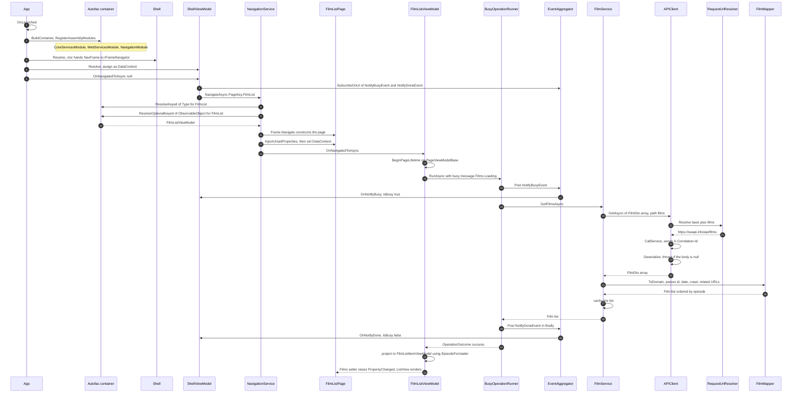
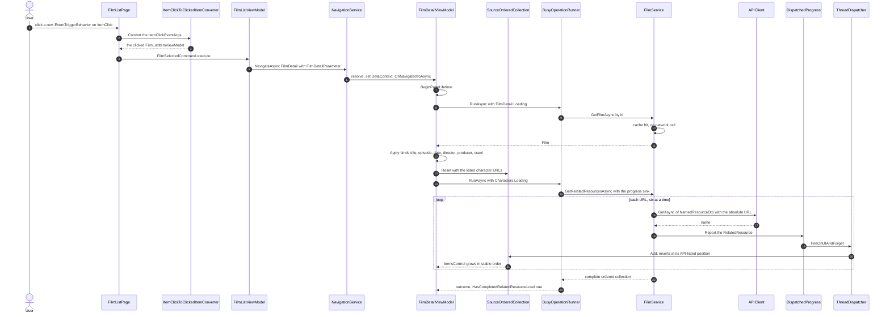
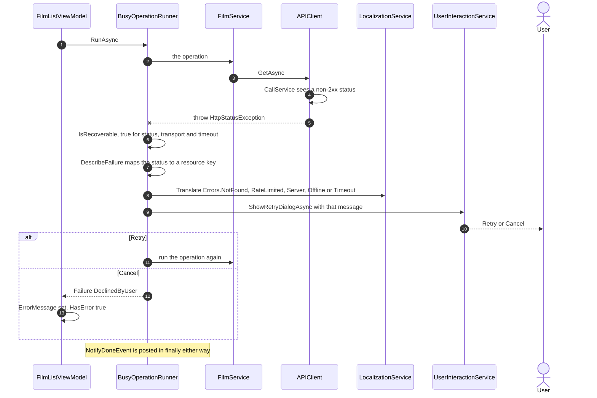
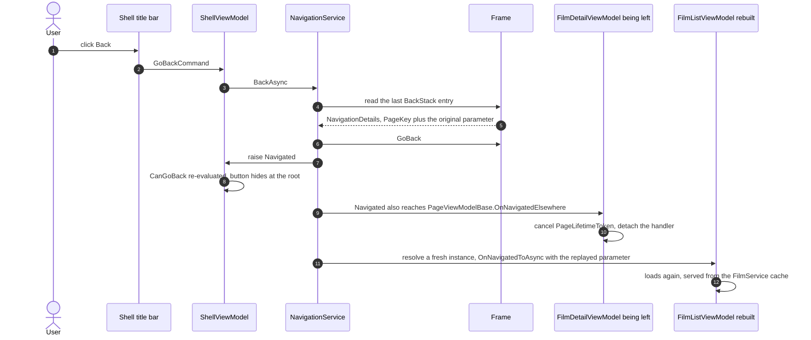

# Change Log — with file and line references

Every change made to the scaffold, with line numbers as of this commit. Line references point at the current state of each file, not at a diff.

**Totals:** 31 files created, 30 modified, 7 deleted. 141 tests passing (73 service + 63 ViewModel + 5 live-API). x64 Debug and ARM64 Release both build with zero warnings. The app has been built, installed and run.

Line references are written as `[file.cs:42](path#L42)` and are clickable.

---

## 0. Requirement coverage

Every requirement in [README.md](README.md), with how it was verified. Option 1 (Star Wars films) was chosen.

| # | Requirement | Status | Verified by |
|---|---|---|---|
| R1 | Page 1 lists all films from the films endpoint | Done | [FilmService.cs:39](DrawboardCodingExercise.Services/FilmService.cs#L39) + [FilmListPage.xaml:45](DrawboardCodingExercise/View/FilmListPage.xaml#L45); six films confirmed on screen |
| R2 | Each row shows title **and** episode number | Done | [FilmListPage.xaml:67](DrawboardCodingExercise/View/FilmListPage.xaml#L67), [:72](DrawboardCodingExercise/View/FilmListPage.xaml#L72); confirmed on screen as `Episode I`–`Episode VI` |
| R3 | Clicking a film navigates to page 2 | Done | [FilmListPage.xaml:55-57](DrawboardCodingExercise/View/FilmListPage.xaml#L55-L57) → [FilmListViewModel.cs:152](DrawboardCodingExercise.ViewModel/FilmListViewModel.cs#L152); confirmed on screen |
| R4 | Page 2 shows title, episode, release date, director, producer | Done | [FilmDetailPage.xaml:28](DrawboardCodingExercise/View/FilmDetailPage.xaml#L28), [:34](DrawboardCodingExercise/View/FilmDetailPage.xaml#L34), [:58](DrawboardCodingExercise/View/FilmDetailPage.xaml#L58), [:72](DrawboardCodingExercise/View/FilmDetailPage.xaml#L72), [:86](DrawboardCodingExercise/View/FilmDetailPage.xaml#L86); all five confirmed on screen |
| R5 | Page 2 lists one related category | Done | Characters — [FilmDetailViewModel.cs:35](DrawboardCodingExercise.ViewModel/FilmDetailViewModel.cs#L35), [FilmDetailPage.xaml:116](DrawboardCodingExercise/View/FilmDetailPage.xaml#L116); unit + live-API tested. Heading confirmed on screen; rows sit below the fold |
| R6 | **Bonus** — opening crawl on page 2 | Done | [FilmDetailPage.xaml:102](DrawboardCodingExercise/View/FilmDetailPage.xaml#L102); confirmed on screen with paragraph breaks intact |
| R7 | No library that talks directly to the API | Done | 17 packages total, none API-specific; only `IAPIClient` over `HttpClient` + Newtonsoft |
| R8 | Solid design principles | Done | SOLID mapping in [implemented-readme.md](implemented-readme.md) §3 |
| R9 | Clean, well-factored code | Done | No `Windows.*` in ViewModel/Services; no DTO escapes the services layer; both pages have empty code-behind |
| R10 | Testable **and** extensible architecture | Done | 63 ViewModel tests run with no UI host; `APIClient` testable offline via an injectable handler; a second API source needs one new service |
| R11 | Automated tests | Done | 141 passing across three projects; measured coverage ViewModel 87.7%, Contracts 74.5%, Services 45.9% |
| R12 | Error checking and reporting to the user | Done | [BusyOperationRunner.cs:172-196](DrawboardCodingExercise.Services/BusyOperationRunner.cs#L172-L196) maps five failure kinds to distinct localized messages; 13 tests |
| R13 | Usability | Done | Aggregated progress, distinct empty/error states, keyboard-navigable list, accessible back button, theme resources throughout |
| R14 | Code structure and current UWP idioms | Done | `x:Bind` in item templates, behaviours instead of code-behind handlers, `x:Uid` localization, `RelativePanel` shell |
| R15 | Persistence not required | Done | In-memory cache only; stated as a non-goal |
| R16 | README with limitations, extensions, considerations | Done | [implemented-readme.md](implemented-readme.md) §5 |
| R17 | AI collaboration: challenges and validation | Done | [implemented-readme.md](implemented-readme.md) §2 and §6 |
| R18 | Zip and send to hiring@drawboard.com | **Outstanding** | Yours to send |

**Still unverified visually:** the character rows themselves. The heading renders, the service resolves real names against the live API, and the ViewModel tests cover insertion order — but the rows sit below the fold in the screenshots taken so far. Scroll the detail page to confirm.

**XML documentation is verified mechanically, not asserted.** `CS1591` is promoted to an **error** in all seven managed projects, so an undocumented public member fails the build. `CS1571`–`CS1573` and `CS1712` (mismatched, duplicated, missing `param`/`typeparam` tags) are also on with documentation generation, and all seven projects rebuild with **zero warnings of any kind**. Inspecting the generated documentation files confirms **633 documented members** — 182 Contracts, 136 ViewModel, 81 UWP head, 76 Services, 43 test support, 115 tests — with **zero** lacking a `summary` or `inheritdoc`.

---

## 0.4 How the solution meets the evaluation criteria

[README.md](README.md) lists eight things the submission is judged on. Each is answered directly below, with files cited so any claim can be checked.

**Solid design principles.** Each type has one job: `RequestUriResolver` builds URIs, `FilmMapper` maps wire format to domain, `FilmService` retrieves and caches, `BusyOperationRunner` orchestrates progress and retry. Dependency inversion holds throughout — ViewModels depend only on `.Contracts` interfaces, never on a concrete service or a platform type. Interfaces stay segregated: `INavigateToAware` and `IProvidePageHeader` are single-method opt-ins rather than a mandatory page base class.

**Clean, well-factored code.** No `Windows.*` reference exists in `.ViewModel` or `.Services`, and no data transfer object escapes the services layer, so the boundaries are enforced by the compiler rather than by convention. Both pages have empty code-behind — the list's click reaches its ViewModel through a XAML behaviour and a converter. The largest type is 251 lines, after the ordered-insertion logic was extracted to [SourceOrderedCollection](DrawboardCodingExercise.ViewModel/Infrastructure/SourceOrderedCollection.cs).

**An architecture that is testable and extensible.** 141 tests run with no UI host and no network, because every platform concern sits behind a `.Contracts` interface; `APIClient` itself is testable offline through an injectable `HttpMessageHandler`. Adding a page is four mechanical edits (a `PageKey` value, one `RegisterView` line, the csproj entries, a resw string) and reuses `PageViewModelBase`, `BusyOperationRunner` and `SourceOrderedCollection<T>` unchanged. **One honest gap:** a second API on a *different* origin does not work as-is — see "Adding a books API" below.

**Automated tests.** 141 tests across three projects, including 5 against the live API whose job is to re-verify the assumptions the offline fixtures rest on, since canned payloads would keep passing if the real service changed shape. Doubles are shared through `.TestSupport` rather than duplicated, and the fixtures deliberately keep the awkward parts — snake_case names, absolute URLs, an unparsable date, a null title. Measured coverage: ViewModel 87.7%, Contracts 74.5%, Services 45.9%.

**Error checking and reporting to the user.** Five distinct localized messages distinguish being offline from a missing resource, throttling, a server fault and a timeout, so the user can judge whether retrying is worth their time ([BusyOperationRunner.cs:172](DrawboardCodingExercise.Services/BusyOperationRunner.cs#L172)). Exceptions the runner does not recognise propagate deliberately, rather than hiding a defect behind a retry dialog. Partial failure is contained: a failed character load still leaves the film's own details on screen with a scoped message.

**Usability for the user.** Progress is aggregated across concurrent operations so the indicator clears only when the last finishes, and empty, error and loading states are distinct rather than inferred from a blank page. The character list fills incrementally and holds a stable order while filling, instead of reshuffling as responses arrive. Not yet done, and stated rather than implied: the accessibility and narrow-window checklist ([implemented-readme.md](implemented-readme.md) §6) has not been walked through.

**Code structure and adherence to current UWP idioms.** Item templates use compiled `x:Bind` while page-level bindings stay classic, because the navigation service assigns `DataContext` *after* construction — a distinction that matters and is commented in the XAML. Gestures reach ViewModels through `Microsoft.Xaml.Behaviors` rather than code-behind handlers, text is localized with `x:Uid`, and colours come from `ThemeResource` so both themes work. XML documentation is a build gate: `CS1591` is an error in all seven projects, giving 633 documented members and zero warnings.

**No persistence required.** Nothing is persisted; the only state is an in-memory cache in `FilmService`, which dies with the process. That cache is a performance decision rather than storage — the films response already carries every field the detail page shows, so a detail view costs no network call and back navigation is instant.

### Adding a books API — what it would actually take

**A new page is easy.** The four edits above, plus a ViewModel deriving from `PageViewModelBase`. Progress, retry, cancellation-on-navigate-away, incremental ordered lists and localization all come for free.

**A new API on the same host is easy too** — `RequestUriResolver` already accepts any path or absolute URL beneath the configured base.

**A new API on a *different* host is the one thing that does not work today.** `ApplicationConfiguration` is registered as a single `IAPISettings`, `APIClient` derives one base URI from it at [APIClient.cs:106](DrawboardCodingExercise.Services/APIClient.cs#L106), and [RequestUriResolver.Resolve](DrawboardCodingExercise.Services/Api/RequestUriResolver.cs#L72) *deliberately rejects* anything outside that origin — a guard that stops a payload redirecting the client, but also stops a second origin. Since `FilmService` is the only consumer of `IAPIClient`, the remedy is contained: register clients keyed per API and let the composition root inject the right one.

```csharp
builder.RegisterType<BookService>().As<IBookService>()
    .WithParameter(ResolvedParameter.ForKeyed<IAPIClient>(ApiName.Library));
```

Services keep taking a plain `IAPIClient`, so no constructor changes, no test changes, and no container types leak into `.Services` — Autofac's keyed resolution acts as the abstract factory, with all container knowledge confined to [WebServicesModule](DrawboardCodingExercise/Module/WebServicesModule.cs). Authentication needs no client change either: `APIClient` already accepts an `HttpMessageHandler`, so a per-API `DelegatingHandler` can attach an API key.

This is described rather than built, because implementing it before a second API exists would be speculative.

---

## 0.5 Debugging walkthrough — the flow, with class and method names

Every participant below is a real type and every call a real method, with the file and line to breakpoint. Follow these four flows and you have walked the whole application.

### Flow A — startup, to the first film on screen



**Breakpoints for flow A**

| Order | Method | Purpose | File |
|---|---|---|---|
| 1 | `App.OnLaunched` | The entry point: builds the container once, then creates the shell and window. | [App.xaml.cs:35](DrawboardCodingExercise/App.xaml.cs#L35) |
| 2 | `App.BuildContainer` | Registers the configuration, the logger, and every Autofac module found in the assembly. | [App.xaml.cs:72](DrawboardCodingExercise/App.xaml.cs#L72) |
| 3 | `ShellViewModel.OnNavigatedToAsync` | Subscribes to the progress events, then kicks off the very first navigation. | [ShellViewModel.cs:81](DrawboardCodingExercise.ViewModel/ShellViewModel.cs#L81) |
| 4 | `NavigationService.NavigateAsync` | Resolves the page type and ViewModel from the key, drives the frame, attaches the data context. | [NavigationService.cs:78](DrawboardCodingExercise/CoreFramework/NavigationService.cs#L78) |
| 5 | `FilmListViewModel.OnNavigatedToAsync` | Starts the film load and projects the result into bindable rows. | [FilmListViewModel.cs:101](DrawboardCodingExercise.ViewModel/FilmListViewModel.cs#L101) |
| 6 | `BusyOperationRunner.RunAsync` | Wraps the load in progress reporting and the retry loop; posts the paired notifications. | [BusyOperationRunner.cs:58](DrawboardCodingExercise.Services/BusyOperationRunner.cs#L58) |
| 7 | `FilmService.GetFilmsAsync` | Returns the cached list, or fetches and caches it behind a gate on first call. | [FilmService.cs:68](DrawboardCodingExercise.Services/FilmService.cs#L68) |
| 8 | `APIClient.GetAsync` | Turns a path into a request and deserializes the JSON response into DTOs. | [APIClient.cs:117](DrawboardCodingExercise.Services/APIClient.cs#L117) |
| 9 | `RequestUriResolver.Resolve` | Builds the final absolute URI — inspect it to confirm the base address was not doubled. | [RequestUriResolver.cs:72](DrawboardCodingExercise.Services/Api/RequestUriResolver.cs#L72) |
| 10 | `APIClient.CallService` | The actual send: attaches the correlation id and turns a non-2xx status into an exception. | [APIClient.cs:219](DrawboardCodingExercise.Services/APIClient.cs#L219) |
| 11 | `APIClient.Deserialize` | Converts the body into DTOs, failing loudly rather than returning null. | [APIClient.cs:187](DrawboardCodingExercise.Services/APIClient.cs#L187) |
| 12 | `FilmMapper.ToDomain` | Maps the snake_case DTOs to the domain model, parsing the id, date and crawl. | [FilmMapper.cs:46](DrawboardCodingExercise.Services/Mapping/FilmMapper.cs#L46) |
| 13 | `EventAggregator.Post` | Fans a message out to matching subscribers synchronously, in registration order. | [EventAggregator.cs:58](DrawboardCodingExercise.Services/EventAggregator/EventAggregator.cs#L58) |
| 14 | `ShellViewModel.OnNotifyBusy` / `OnNotifyDone` | Adds or clears the entry behind the title bar's progress ring. | [ShellViewModel.cs:115](DrawboardCodingExercise.ViewModel/ShellViewModel.cs#L115) / [:98](DrawboardCodingExercise.ViewModel/ShellViewModel.cs#L98) |

### Flow B — clicking a film, and the character fan-out



**Breakpoints for flow B**

| Order | Method | Purpose | File |
|---|---|---|---|
| 1 | `ItemClickToClickedItemConverter.Convert` | Pulls the clicked row out of the event args — a null here means the click missed a row. | [ItemClickToClickedItemConverter.cs:28](DrawboardCodingExercise/ValueConverters/ItemClickToClickedItemConverter.cs#L28) |
| 2 | `FilmListViewModel.OnFilmSelected` | Navigates to the detail page, carrying only the film's identifier. | [FilmListViewModel.cs:144](DrawboardCodingExercise.ViewModel/FilmListViewModel.cs#L144) |
| 3 | `FilmDetailViewModel.OnNavigatedToAsync` | Casts the navigation parameter and starts the detail load; a bad cast becomes the not-found state. | [FilmDetailViewModel.cs:157](DrawboardCodingExercise.ViewModel/FilmDetailViewModel.cs#L157) |
| 4 | `FilmService.GetFilmAsync` | Resolves the film from the cached list — on a warm cache this issues no request at all. | [FilmService.cs:103](DrawboardCodingExercise.Services/FilmService.cs#L103) |
| 5 | `FilmDetailViewModel.Apply` | Binds the five detail fields and the crawl, and primes the ordered collection with the character URLs. | [FilmDetailViewModel.cs:201](DrawboardCodingExercise.ViewModel/FilmDetailViewModel.cs#L201) |
| 6 | `FilmMapper.NormalizeCrawl` | Drops the API's hard line wraps so the crawl reflows, while keeping its paragraph breaks. | [FilmMapper.cs:136](DrawboardCodingExercise.Services/Mapping/FilmMapper.cs#L136) |
| 7 | `FilmDetailViewModel.LoadRelatedResourcesAsync` | Runs the character load as a *separate* guarded operation, so its failure cannot cost the film details. | [FilmDetailViewModel.cs:225](DrawboardCodingExercise.ViewModel/FilmDetailViewModel.cs#L225) |
| 8 | `FilmService.GetRelatedResourcesAsync` | Fans out one request per character URL and assembles them back into API order. | [FilmService.cs:111](DrawboardCodingExercise.Services/FilmService.cs#L111) |
| 9 | `FilmService.ResolveAsync` | Resolves a single character; the semaphore here is what caps the fan-out at six in flight. | [FilmService.cs:164](DrawboardCodingExercise.Services/FilmService.cs#L164) |
| 10 | `DispatchedProgress.Report` | Marshals each arrival onto the UI thread, since a bound collection cannot be touched off it. | [DispatchedProgress.cs:39](DrawboardCodingExercise.ViewModel/Infrastructure/DispatchedProgress.cs#L39) |
| 11 | `SourceOrderedCollection.Add` | The placement decision: inserts the row at its API-listed position instead of appending. | [SourceOrderedCollection.cs:74](DrawboardCodingExercise.ViewModel/Infrastructure/SourceOrderedCollection.cs#L74) |

> Breakpointing inside `ResolveAsync` serialises the fan-out and hides the out-of-order arrival it exists to handle. To observe the real interleaving, use a tracepoint that logs `url` and continues rather than a breakpoint that stops.

### Flow C — a failed request and the retry prompt



**Breakpoints for flow C** — force this path by pointing [ApplicationConfiguration.cs:21](DrawboardCodingExercise/Configuration/ApplicationConfiguration.cs#L21) at an unreachable host.

| Order | Method | Purpose | File |
|---|---|---|---|
| 1 | `APIClient.CallService` | Where the response status is inspected and a non-2xx becomes `HttpStatusException`. | [APIClient.cs:219](DrawboardCodingExercise.Services/APIClient.cs#L219) |
| 2 | `BusyOperationRunner.RunAsync` | The catch filters sort the failure into retryable, cancelled, or a defect that should propagate. | [BusyOperationRunner.cs:58](DrawboardCodingExercise.Services/BusyOperationRunner.cs#L58) |
| 3 | `BusyOperationRunner.DescribeFailure` | Chooses which localized message the user sees — offline, not-found, throttled, server or timeout. | [BusyOperationRunner.cs:172](DrawboardCodingExercise.Services/BusyOperationRunner.cs#L172) |
| 4 | `BusyOperationRunner.AskWhetherToRetryAsync` | Shows the dialog on the UI thread and returns the choice that decides retry versus give up. | [BusyOperationRunner.cs:138](DrawboardCodingExercise.Services/BusyOperationRunner.cs#L138) |

### Flow D — back navigation



**Breakpoints for flow D**

| Order | Method | Purpose | File |
|---|---|---|---|
| 1 | `ShellViewModel.OnGoBack` | The back button's command, enabled only while the navigation stack has somewhere to return to. | [ShellViewModel.cs:61](DrawboardCodingExercise.ViewModel/ShellViewModel.cs#L61) |
| 2 | `NavigationService.BackAsync` | Reads the back-stack entry, replays its original parameter, and raises `Navigated`. | [NavigationService.cs:130](DrawboardCodingExercise/CoreFramework/NavigationService.cs#L130) |
| 3 | `PageViewModelBase.OnNavigatedElsewhere` | Cancels the departing page's token so its in-flight work stops, and detaches its own handler. | [PageViewModelBase.cs:70](DrawboardCodingExercise.ViewModel/Infrastructure/PageViewModelBase.cs#L70) |
| 4 | `FilmListViewModel.OnNavigatedToAsync` | Runs again on a brand-new instance — the state you see is reloaded from cache, not restored. | [FilmListViewModel.cs:101](DrawboardCodingExercise.ViewModel/FilmListViewModel.cs#L101) |

### Debugging notes

- **Attach to the installed package.** Debug → Other Debug Targets → Debug Installed App Package → *Drawboard Coding Exercise*. Or set the UWP project as startup and press F5.
- **Serilog writes to the debug sink**, so every REST call appears in the Output window with method, path, status, elapsed and correlation id. Often faster than stepping.
- **A ViewModel is a new object on every navigation**, back included. A breakpoint that appears to be hit "again with cleared state" is a *different instance*, not a reset one.
- **`FilmService` is the only single instance** in the data path, so it is where cached state lives. Watch `_films` and `_relatedResourceCache` there.
- **A second visit to the same film makes no HTTP call at all.** If you are breakpointing in `APIClient` and nothing stops, that is the cache working, not a fault.

---

## 1. Behavioural changes to test first

These are the ones worth exercising in the running app. §2 onwards is the full inventory.

### 1.1 The app now opens on a real film list

| What | Where |
|---|---|
| Landing page changed from `Welcome` to the film list | [ShellViewModel.cs:86](DrawboardCodingExercise.ViewModel/ShellViewModel.cs#L86) |
| Page keys replaced (`Welcome`/`PageA` → `FilmList`/`FilmDetail`) | [PageKey.cs:17](DrawboardCodingExercise.Contracts/PageKey.cs#L17), [PageKey.cs:23](DrawboardCodingExercise.Contracts/PageKey.cs#L23) |
| Both pages registered | [NavigationModule.cs:26-27](DrawboardCodingExercise/Module/NavigationModule.cs#L26-L27) |
| API base address pointed at the live service | [ApplicationConfiguration.cs:21](DrawboardCodingExercise/Configuration/ApplicationConfiguration.cs#L21) |

**Expect:** six films, each with a title and `Episode IV`-style caption, appearing after a brief progress indicator in the title bar.

### 1.2 Four scaffold defects fixed

**The shell could crash the whole app.** `OnNotifyDone` called `RemoveAt(IndexOf(...))` with no guard, and `IndexOf` returns `-1` for an unmatched entry — throwing on the UI thread from an event handler, which is unrecoverable.

- Guard: [ShellViewModel.cs:100-105](DrawboardCodingExercise.ViewModel/ShellViewModel.cs#L100-L105)
- Regression test: [ShellViewModelTests.cs:128](DrawboardCodingExercise.ViewModel.UnitTests/ShellViewModelTests.cs#L128)

**The back button's state went stale.** `BackAsync` never raised `Navigated`, and the shell refreshes `CanGoBack` from that event, so the button stayed enabled at the root of the stack until the next forward navigation.

- Now raised on back as well as forward: [NavigationService.cs:144](DrawboardCodingExercise/CoreFramework/NavigationService.cs#L144) (forward is [:98](DrawboardCodingExercise/CoreFramework/NavigationService.cs#L98))

**The back button never appeared at all.** `Shell.xaml` bound the boolean `CanGoBack` straight to `Visibility`, without the converter already sitting in the same resource dictionary.

- Fixed binding: [Shell.xaml:38](DrawboardCodingExercise/View/Shell.xaml#L38)

**Expect:** click a film, then use the back button in the title bar — it should be visible on page 2, take you back, and then disappear at the root.

**The dispatcher discarded its inner task.** `RunOnUIThreadAsync` handed an asynchronous callback to a void-returning platform primitive, so a cross-thread caller resumed as soon as the callback yielded rather than when the work finished — meaning a navigation from a worker thread did not actually await the page load.

- Completion-source bridge: [ThreadDispatcher.cs:41-64](DrawboardCodingExercise/CoreFramework/ThreadDispatcher.cs#L41-L64)

**The event aggregator delivered messages out of order — found by running the app.** Each subscription owned an independent `ActionBlock` consuming on the thread pool, so two messages handled by two *different* subscriptions could arrive in either order. Busy and completion notifications are handled by separate subscriptions on the shell, so a completion could overtake its own busy notification: the completion found nothing to remove, the busy notification was then added, and nothing was left to clear it. The progress indicator stayed visible with stale text for the rest of the session.

- Rewritten for ordered, synchronous fan-out: [EventAggregator.cs](DrawboardCodingExercise.Services/EventAggregator/EventAggregator.cs)
- Reproducing test — measured `done:1` arriving before `busy:1`: [EventAggregatorTests.cs:83](DrawboardCodingExercise.Services.UnitTests/EventAggregatorTests.cs#L83)
- `System.Threading.Tasks.Dataflow` dropped from [Services.csproj](DrawboardCodingExercise.Services/DrawboardCodingExercise.Services.csproj), now unused
- Handler exceptions are logged rather than escaping, because completions are posted from `finally` blocks where an escaping exception would mask the original failure

Two lessons worth recording. First, the guard added to `ShellViewModel` above stopped the crash but converted it into a silent stuck indicator — it treated the symptom while the ordering defect underneath went unnoticed. Second, `RecordingEventAggregator`, the test double, delivers synchronously and was therefore **more reliable than production**: every ViewModel and runner test passed against ordering guarantees the real implementation never made. [EventAggregatorTests](DrawboardCodingExercise.Services.UnitTests/EventAggregatorTests.cs) now tests the real class directly, and the double's behaviour matches it.

Also renamed `FilmDetail.Loading` from "Loading film" to **"Loading film details"** — one letter apart from "Loading films" made the stale text almost impossible to read as a symptom.

### 1.3 A leak fixed that I introduced

Page ViewModels implement `IDisposable` (via their base class), and Autofac retains disposable components resolved from the root container — so every ViewModel ever created would have become unreachable but uncollectable, growing with navigation count.

- `ExternallyOwned()` on the registration: [MvvmViewExtensions.cs:39](DrawboardCodingExercise/Module/MvvmViewExtensions.cs#L39)

Not observable in the UI; noted because it is the change least visible and most easily missed.

### 1.4 Package signing enabled

The scaffold shipped with `AppxPackageSigningEnabled=false`, which produces an unsigned package. Windows will only register an unsigned package when Developer Mode is enabled, so the app could not be installed on a machine without it.

| What | Where |
|---|---|
| Signing turned on | [csproj:27](DrawboardCodingExercise/DrawboardCodingExercise.csproj#L27) |
| Certificate key file | [csproj:28](DrawboardCodingExercise/DrawboardCodingExercise.csproj#L28) |
| Key file referenced by the project | [csproj:132](DrawboardCodingExercise/DrawboardCodingExercise.csproj#L132) |

`DrawboardCodingExercise_TemporaryKey.pfx` is a self-signed development certificate, valid to 2029, with subject `CN=StevenBlom` — it **must** match the `Publisher` in [Package.appxmanifest:11](DrawboardCodingExercise/Package.appxmanifest#L11) or the build fails.

**It is deliberately not committed.** The scaffold's `.gitignore` excludes `*.pfx`, and a private key does not belong in a repository that may be public. Signing is therefore conditional on the file existing: a fresh clone builds unsigned and installs with Developer Mode, exactly as the original scaffold did, and signing switches itself on once a key is generated.

**This does not remove the need for one elevated step.** A self-signed certificate is not a trusted authority, so installation fails with `0x800B0109` (untrusted root) until the certificate is added to the machine's Trusted People store:

```powershell
# Requires administrator
Import-Certificate -FilePath DrawboardCodingExercise\DrawboardCodingExercise_TemporaryKey.cer `
    -CertStoreLocation Cert:\LocalMachine\TrustedPeople
```

Either that or Developer Mode is required — both need admin. Signing is still the better default: it produces a genuinely signed artefact, and on a machine where the certificate is trusted the app installs with no developer settings at all.

To generate a fresh certificate on another machine:

```powershell
$cert = New-SelfSignedCertificate -Type Custom -Subject "CN=StevenBlom" -KeyUsage DigitalSignature `
    -CertStoreLocation "Cert:\CurrentUser\My" -KeyExportPolicy Exportable `
    -TextExtension @("2.5.29.37={text}1.3.6.1.5.5.7.3.3","2.5.29.19={text}")
[IO.File]::WriteAllBytes("DrawboardCodingExercise_TemporaryKey.pfx", $cert.Export("Pfx", ""))
```

Then update the thumbprint at [csproj:29](DrawboardCodingExercise/DrawboardCodingExercise.csproj#L29).

### 1.5 Error handling and retry

| What | Where |
|---|---|
| Retry loop, and the completion notification posted in `finally` | [BusyOperationRunner.cs:58-107](DrawboardCodingExercise.Services/BusyOperationRunner.cs#L58-L107) |
| Which failures are retryable (unrecognised ones deliberately propagate) | [BusyOperationRunner.cs:122-126](DrawboardCodingExercise.Services/BusyOperationRunner.cs#L122-L126) |
| Retry prompt marshalled onto the UI thread | [BusyOperationRunner.cs:138-166](DrawboardCodingExercise.Services/BusyOperationRunner.cs#L138-L166) |
| Failure → specific localized message (offline / not-found / throttled / server / timeout) | [BusyOperationRunner.cs:172-196](DrawboardCodingExercise.Services/BusyOperationRunner.cs#L172-L196) |
| Retry dialog gained a message parameter | [UserInteractionService.cs:29](DrawboardCodingExercise/CoreFramework/UserInteractionService.cs#L29) |
| Dismissing the dialog resolves to Cancel, not a silent retry | [UserInteractionService.cs:42](DrawboardCodingExercise/CoreFramework/UserInteractionService.cs#L42) |

**To test:** change the base address at [ApplicationConfiguration.cs:21](DrawboardCodingExercise/Configuration/ApplicationConfiguration.cs#L21) to an unreachable host, rebuild, and launch. Expect the offline message with Retry/Cancel; Cancel should leave a readable inline error rather than a blank page.

### 1.6 URI construction moved into the client

The scaffold's `APIClient` built request URLs by string concatenation:

```csharp
new Uri($"{baseUri}/{path}")
```

That is correct only for relative paths. The films payload links related resources by **absolute** URL, so concatenating produced `https://swapi.info/api/https://swapi.info/api/people/1` — a 404 that reads like a server fault.

The first implementation worked around it with a `RelativeResourcePath` helper that stripped the base off before calling the client. That treated the symptom. `Uri`'s own base-relative constructor already resolves **both** forms correctly, so the root fix is one line in the right place:

| What | Where |
|---|---|
| Base address normalized once, in the constructor | [APIClient.cs:66](DrawboardCodingExercise.Services/APIClient.cs#L66) |
| Every request URI resolved through one seam | [APIClient.cs:183](DrawboardCodingExercise.Services/APIClient.cs#L183) |
| `new Uri(baseUri, path)` — handles relative and absolute | [RequestUriResolver.cs:90](DrawboardCodingExercise.Services/Api/RequestUriResolver.cs#L90) |
| Trailing-slash normalization | [RequestUriResolver.cs:46](DrawboardCodingExercise.Services/Api/RequestUriResolver.cs#L46) |
| Origin and base-path guard | [RequestUriResolver.cs:93](DrawboardCodingExercise.Services/Api/RequestUriResolver.cs#L93), [:112](DrawboardCodingExercise.Services/Api/RequestUriResolver.cs#L112) |

**Why the guard still exists.** `new Uri(base, absolute)` accepts an absolute URL pointing *anywhere*, which would let a payload send the client to a host of its choosing. Every resolved URI is checked to sit beneath the base address and rejected loudly otherwise, so that decision stays visible in our code rather than buried in the transport.

**What this bought:**

- **`FilmService` no longer knows the API's address.** Its constructor dropped `IAPISettings` ([FilmService.cs:61](DrawboardCodingExercise.Services/FilmService.cs#L61)) and it now passes payload URLs straight through ([:184](DrawboardCodingExercise.Services/FilmService.cs#L184)). Resolving URIs was never its job.
- **One malformed URL no longer costs the whole list.** Previously an unusable URL threw, and `Task.WhenAll` turned that into a total failure of all eighteen characters. It is now logged and skipped ([:193](DrawboardCodingExercise.Services/FilmService.cs#L193)), leaving its slot empty and filtered out ([:142](DrawboardCodingExercise.Services/FilmService.cs#L142)) — matching the tolerance the mapper already applies to every other payload field. Genuine request failures still propagate so a retry can be offered.
- **Misconfiguration fails at construction**, not on the first request, so a bad base address can't be mistaken for an unreachable server.
- **Correct escaping.** `Uri` resolution handles percent-encoding; string concatenation could double-encode.
- **Smaller surface.** `RelativeResourcePath` (95 lines) deleted; [RequestUriResolver.cs](DrawboardCodingExercise.Services/Api/RequestUriResolver.cs) (124 lines) replaces it *and* the concatenation it used to compensate for. Tests retargeted to [RequestUriResolverTests.cs](DrawboardCodingExercise.Services.UnitTests/RequestUriResolverTests.cs) — 15 tests, up from 10.

### 1.7 Testability and factoring follow-ups

Two weaknesses found by auditing against the README's evaluation criteria rather than by a failing test.

**`APIClient` had no offline coverage at all** — 0 of 124 lines. Its `HttpClient` is `static readonly` with no seam, so status-code translation, the correlation header and the null-body guard could only be exercised against the live service. A second constructor now accepts an `HttpMessageHandler`:

| What | Where |
|---|---|
| Handler-accepting constructor | [APIClient.cs:74](DrawboardCodingExercise.Services/APIClient.cs#L74) |
| Shared client kept as one instance per application | [APIClient.cs:36](DrawboardCodingExercise.Services/APIClient.cs#L36) |
| In-memory recording handler | [RecordingHttpMessageHandler.cs](DrawboardCodingExercise.TestSupport/RecordingHttpMessageHandler.cs) |
| 19 tests | [APIClientTests.cs](DrawboardCodingExercise.Services.UnitTests/APIClientTests.cs) |

Not a test-only hatch: a supplied `DelegatingHandler` is the standard way to add retry or telemetry later. A handler gets its own client, so the shared one stays a single instance as the platform guidance requires, and Autofac still selects the three-parameter constructor because no handler is registered. **Coverage: 0% → 43.5%.**

The regression that started all this is now pinned offline — `GetAsync_AbsoluteUrlFromAPayload_RequestsItUnchanged` asserts the request URI contains no `api/https`.

**`FilmDetailViewModel` was doing too much.** Its ordered-insertion logic was a second responsibility sitting inside a page ViewModel, reachable only by staging a navigation. Extracted to [SourceOrderedCollection.cs](DrawboardCodingExercise.ViewModel/Infrastructure/SourceOrderedCollection.cs), with [12 tests](DrawboardCodingExercise.ViewModel.UnitTests/SourceOrderedCollectionTests.cs) covering every arrival order, unlisted items, case-insensitive keys and reset. The ViewModel dropped from 297 to 251 lines and its existing tests passed unchanged — which is the evidence the extraction preserved behaviour.

### 1.8 Ordering, caching and cancellation

| What | Where |
|---|---|
| Character rows placed at their API-listed position as responses arrive out of order | [FilmDetailViewModel.cs:259-281](DrawboardCodingExercise.ViewModel/FilmDetailViewModel.cs#L259-L281) |
| An unlisted resource sorts last (`int.MaxValue`, not `-1` — the bug a test caught) | [FilmDetailViewModel.cs:294](DrawboardCodingExercise.ViewModel/FilmDetailViewModel.cs#L294) |
| Film cache, guarded so concurrent callers share one request | [FilmService.cs:79](DrawboardCodingExercise.Services/FilmService.cs#L79) |
| Concurrency capped at six in-flight requests | [FilmService.cs:36](DrawboardCodingExercise.Services/FilmService.cs#L36) |
| Loads cancel when the user navigates away | [PageViewModelBase.cs:55-85](DrawboardCodingExercise.ViewModel/Infrastructure/PageViewModelBase.cs#L55-L85) |

**Expect:** the character list fills progressively and stays in a stable order while filling. Going back to the list and forward again should be instant — no second network call.

---

## 2. Created files

### Contracts — domain model and service abstractions

| Lines | File | Purpose |
|---|---|---|
| 47 | [Model/Film.cs](DrawboardCodingExercise.Contracts/Model/Film.cs) | Immutable film projection; related URLs grouped by category |
| 15 | [Model/RelatedResource.cs](DrawboardCodingExercise.Contracts/Model/RelatedResource.cs) | A resolved related resource |
| 28 | [Model/RelatedResourceKind.cs](DrawboardCodingExercise.Contracts/Model/RelatedResourceKind.cs) | The five categories |
| 14 | [Navigation/FilmDetailParameter.cs](DrawboardCodingExercise.Contracts/Navigation/FilmDetailParameter.cs) | Identifier-only navigation parameter |
| 71 | [Services/IFilmService.cs](DrawboardCodingExercise.Contracts/Services/IFilmService.cs) | Film retrieval contract |
| 45 | [Services/IBusyOperationRunner.cs](DrawboardCodingExercise.Contracts/Services/IBusyOperationRunner.cs) | Progress + retry contract |
| 97 | [Services/OperationOutcome.cs](DrawboardCodingExercise.Contracts/Services/OperationOutcome.cs) | Outcome type and failure reasons |

### Services — transport, mapping, orchestration

| Lines | File | Purpose |
|---|---|---|
| 124 | [Api/RequestUriResolver.cs](DrawboardCodingExercise.Services/Api/RequestUriResolver.cs) | Builds every request URI; resolves relative *and* absolute forms; rejects a foreign origin |
| 35 | [Api/ApiSerializerSettings.cs](DrawboardCodingExercise.Services/Api/ApiSerializerSettings.cs) | Shared serializer settings so tests cannot drift from production |
| 77 | [Api/Dto/FilmDto.cs](DrawboardCodingExercise.Services/Api/Dto/FilmDto.cs) | Wire format, snake_case names declared explicitly |
| 23 | [Api/Dto/NamedResourceDto.cs](DrawboardCodingExercise.Services/Api/Dto/NamedResourceDto.cs) | One shape for all five related categories |
| 162 | [Mapping/FilmMapper.cs](DrawboardCodingExercise.Services/Mapping/FilmMapper.cs) | Wire → domain, tolerating every malformed field |
| 194 | [FilmService.cs](DrawboardCodingExercise.Services/FilmService.cs) | Caching, bounded fan-out, progress reporting |
| 197 | [BusyOperationRunner.cs](DrawboardCodingExercise.Services/BusyOperationRunner.cs) | Progress pairing, retry loop, failure explanation |

Key anchors: `CreateBaseUri` [:35](DrawboardCodingExercise.Services/Api/RequestUriResolver.cs#L35), `Resolve` [:72](DrawboardCodingExercise.Services/Api/RequestUriResolver.cs#L72), origin guard [:112](DrawboardCodingExercise.Services/Api/RequestUriResolver.cs#L112) · `GetFilmsAsync` [:71](DrawboardCodingExercise.Services/FilmService.cs#L71), `GetFilmAsync` [:106](DrawboardCodingExercise.Services/FilmService.cs#L106), `GetRelatedResourcesAsync` [:112](DrawboardCodingExercise.Services/FilmService.cs#L112), `ResolveAsync` [:171](DrawboardCodingExercise.Services/FilmService.cs#L171).

### ViewModel — presentation

| Lines | File | Purpose |
|---|---|---|
| 156 | [FilmListViewModel.cs](DrawboardCodingExercise.ViewModel/FilmListViewModel.cs) | Page 1 state and navigation command |
| 297 | [FilmDetailViewModel.cs](DrawboardCodingExercise.ViewModel/FilmDetailViewModel.cs) | Page 2 fields, crawl, incremental character list |
| 20 | [Items/FilmListItemViewModel.cs](DrawboardCodingExercise.ViewModel/Items/FilmListItemViewModel.cs) | Immutable list row |
| 16 | [Items/RelatedResourceItemViewModel.cs](DrawboardCodingExercise.ViewModel/Items/RelatedResourceItemViewModel.cs) | Immutable character row |
| 115 | [Infrastructure/PageViewModelBase.cs](DrawboardCodingExercise.ViewModel/Infrastructure/PageViewModelBase.cs) | Navigate-away cancellation, self-removing subscription |
| 41 | [Infrastructure/DispatchedProgress.cs](DrawboardCodingExercise.ViewModel/Infrastructure/DispatchedProgress.cs) | Progress delivered on the UI thread |
| 57 | [Formatting/EpisodeFormatter.cs](DrawboardCodingExercise.ViewModel/Formatting/EpisodeFormatter.cs) | Roman numerals, digit fallback out of range |
| 33 | [DesignTime/DesignTimeFilmListViewModel.cs](DrawboardCodingExercise.ViewModel/DesignTime/DesignTimeFilmListViewModel.cs) | Designer sample rows |
| 39 | [DesignTime/DesignTimeFilmDetailViewModel.cs](DrawboardCodingExercise.ViewModel/DesignTime/DesignTimeFilmDetailViewModel.cs) | Designer sample content |

Key anchors: `OnNavigatedToAsync` [FilmListViewModel.cs:101](DrawboardCodingExercise.ViewModel/FilmListViewModel.cs#L101), `IsEmpty` [:91](DrawboardCodingExercise.ViewModel/FilmListViewModel.cs#L91), `OnFilmSelected` [:144](DrawboardCodingExercise.ViewModel/FilmListViewModel.cs#L144) · `Apply` [FilmDetailViewModel.cs:198](DrawboardCodingExercise.ViewModel/FilmDetailViewModel.cs#L198), `LoadRelatedResourcesAsync` [:223](DrawboardCodingExercise.ViewModel/FilmDetailViewModel.cs#L223).

### UWP head — views

| Lines | File |
|---|---|
| 106 | [View/FilmListPage.xaml](DrawboardCodingExercise/View/FilmListPage.xaml) |
| 20 | [View/FilmListPage.xaml.cs](DrawboardCodingExercise/View/FilmListPage.xaml.cs) |
| 158 | [View/FilmDetailPage.xaml](DrawboardCodingExercise/View/FilmDetailPage.xaml) |
| 20 | [View/FilmDetailPage.xaml.cs](DrawboardCodingExercise/View/FilmDetailPage.xaml.cs) |
| 43 | [ValueConverters/ItemClickToClickedItemConverter.cs](DrawboardCodingExercise/ValueConverters/ItemClickToClickedItemConverter.cs) |

Both pages have empty code-behind. The list's click gesture reaches the ViewModel through a XAML behaviour plus the converter above, so no event handler lives in the view.

### Tests

| Lines | File |
|---|---|
| 25 | [TestSupport csproj](DrawboardCodingExercise.TestSupport/DrawboardCodingExercise.TestSupport.csproj) |
| 173 | [TestSupport/StubApiClient.cs](DrawboardCodingExercise.TestSupport/StubApiClient.cs) |
| 93 | [TestSupport/SampleFilmPayloads.cs](DrawboardCodingExercise.TestSupport/SampleFilmPayloads.cs) |
| 89 | [TestSupport/RecordingEventAggregator.cs](DrawboardCodingExercise.TestSupport/RecordingEventAggregator.cs) |
| 63 | [TestSupport/FakeBusyOperationRunner.cs](DrawboardCodingExercise.TestSupport/FakeBusyOperationRunner.cs) |
| 31 | [TestSupport/ImmediateThreadDispatcher.cs](DrawboardCodingExercise.TestSupport/ImmediateThreadDispatcher.cs) |
| 31 | [TestSupport/KeyEchoLocalizationService.cs](DrawboardCodingExercise.TestSupport/KeyEchoLocalizationService.cs) |
| 27 | [TestSupport/StubApiSettings.cs](DrawboardCodingExercise.TestSupport/StubApiSettings.cs) |
| 22 | [TestSupport/SilentLogger.cs](DrawboardCodingExercise.TestSupport/SilentLogger.cs) |
| 388 | [Services.UnitTests/FilmServiceTests.cs](DrawboardCodingExercise.Services.UnitTests/FilmServiceTests.cs) — 18 tests |
| 222 | [Services.UnitTests/BusyOperationRunnerTests.cs](DrawboardCodingExercise.Services.UnitTests/BusyOperationRunnerTests.cs) — 13 tests |
| 173 | [Services.UnitTests/RequestUriResolverTests.cs](DrawboardCodingExercise.Services.UnitTests/RequestUriResolverTests.cs) — 15 tests |
| 37 | [ViewModel.UnitTests csproj](DrawboardCodingExercise.ViewModel.UnitTests/DrawboardCodingExercise.ViewModel.UnitTests.csproj) |
| 292 | [ViewModel.UnitTests/FilmDetailViewModelTests.cs](DrawboardCodingExercise.ViewModel.UnitTests/FilmDetailViewModelTests.cs) |
| 221 | [ViewModel.UnitTests/FilmListViewModelTests.cs](DrawboardCodingExercise.ViewModel.UnitTests/FilmListViewModelTests.cs) |
| 198 | [ViewModel.UnitTests/ShellViewModelTests.cs](DrawboardCodingExercise.ViewModel.UnitTests/ShellViewModelTests.cs) |
| 73 | [ViewModel.UnitTests/TestFilms.cs](DrawboardCodingExercise.ViewModel.UnitTests/TestFilms.cs) |
| 52 | [ViewModel.UnitTests/EpisodeFormatterTests.cs](DrawboardCodingExercise.ViewModel.UnitTests/EpisodeFormatterTests.cs) |
| 134 | [IntegrationTests/SwapiEndpointTests.cs](DrawboardCodingExercise.Services.IntegrationTests/SwapiEndpointTests.cs) — 5 live-API tests |

### Documentation

[implemented-readme.md](implemented-readme.md) — the consolidated implementation reference, and the place to start. [CHANGES.md](CHANGES.md) (this file) is its detail companion; [CLAUDE.md](CLAUDE.md) holds the build and run commands.

Four earlier documents (`SOLUTION.md`, `AI-COLLABORATION.md`, `ARCHITECTURE.md`, `IMPLEMENTATION_PLAN.md`) were consolidated into `implemented-readme.md` and removed, so that one file is the single reference rather than six overlapping ones.

---

## 3. Modified files

### Contracts

| File | Change |
|---|---|
| [PageKey.cs](DrawboardCodingExercise.Contracts/PageKey.cs) | Values replaced: `FilmList` [:17](DrawboardCodingExercise.Contracts/PageKey.cs#L17), `FilmDetail` [:23](DrawboardCodingExercise.Contracts/PageKey.cs#L23) |
| [CoreFramework/INavigationService.cs](DrawboardCodingExercise.Contracts/CoreFramework/INavigationService.cs) | Nullable parameter annotation; documented the per-navigation ViewModel lifetime and that `Navigated` fires in both directions |
| [CoreFramework/INavigateToAware.cs](DrawboardCodingExercise.Contracts/CoreFramework/INavigateToAware.cs) | Nullable parameter; documented thread and exception behaviour |
| [CoreFramework/IThreadDispatcher.cs](DrawboardCodingExercise.Contracts/CoreFramework/IThreadDispatcher.cs) | Full documentation, incl. fire-and-forget semantics |
| [CoreFramework/IProvidePageHeader.cs](DrawboardCodingExercise.Contracts/CoreFramework/IProvidePageHeader.cs) | Documented that the value is a key fragment, not display text |
| [CoreFramework/ActionContext.cs](DrawboardCodingExercise.Contracts/CoreFramework/ActionContext.cs) | `AsyncLocal<string?>` for nullable correctness [:13](DrawboardCodingExercise.Contracts/CoreFramework/ActionContext.cs#L13) |
| [Services/IEventAggregator.cs](DrawboardCodingExercise.Contracts/Services/IEventAggregator.cs) | Full documentation, incl. subscription-lifetime warning |
| [Services/IUserInteractionService.cs](DrawboardCodingExercise.Contracts/Services/IUserInteractionService.cs) | New message overload [:29](DrawboardCodingExercise.Contracts/Services/IUserInteractionService.cs#L29); documented UI-thread requirement |
| [Events/NotifyBusyEvent.cs](DrawboardCodingExercise.Contracts/Events/NotifyBusyEvent.cs), [NotifyDoneEvent.cs](DrawboardCodingExercise.Contracts/Events/NotifyDoneEvent.cs) | Documented the exact-match pairing requirement |
| [csproj](DrawboardCodingExercise.Contracts/DrawboardCodingExercise.Contracts.csproj) | `Nullable` [:6](DrawboardCodingExercise.Contracts/DrawboardCodingExercise.Contracts.csproj#L6); doc gate [:10-12](DrawboardCodingExercise.Contracts/DrawboardCodingExercise.Contracts.csproj#L10-L12) |

### Services

| File | Change |
|---|---|
| [IAPIClient.cs](DrawboardCodingExercise.Services/IAPIClient.cs) | Cancellation tokens on all three methods; documented that paths must be relative and that images on another host are unreachable |
| [APIClient.cs](DrawboardCodingExercise.Services/APIClient.cs) | Tokens threaded to `SendAsync` [:181](DrawboardCodingExercise.Services/APIClient.cs#L181); null-body guard [:140](DrawboardCodingExercise.Services/APIClient.cs#L140) |
| [IAPISettings.cs](DrawboardCodingExercise.Services/IAPISettings.cs) | Documented the base-address contract |
| [HttpStatusException.cs](DrawboardCodingExercise.Services/HttpStatusException.cs) | Added a message carrying the status code |
| [EventAggregator/EventAggregator.cs](DrawboardCodingExercise.Services/EventAggregator/EventAggregator.cs) | Documentation only |
| [csproj](DrawboardCodingExercise.Services/DrawboardCodingExercise.Services.csproj) | `Nullable` [:6](DrawboardCodingExercise.Services/DrawboardCodingExercise.Services.csproj#L6); doc gate [:10-12](DrawboardCodingExercise.Services/DrawboardCodingExercise.Services.csproj#L10-L12) |

### ViewModel

| File | Change |
|---|---|
| [ShellViewModel.cs](DrawboardCodingExercise.ViewModel/ShellViewModel.cs) | Unmatched-completion guard [:100-105](DrawboardCodingExercise.ViewModel/ShellViewModel.cs#L100-L105); lands on the film list [:86](DrawboardCodingExercise.ViewModel/ShellViewModel.cs#L86); detaches from the navigation event on dispose [:127](DrawboardCodingExercise.ViewModel/ShellViewModel.cs#L127) |
| [DesignTime/DesignTimeShellViewModel.cs](DrawboardCodingExercise.ViewModel/DesignTime/DesignTimeShellViewModel.cs) | Documentation only |
| [csproj](DrawboardCodingExercise.ViewModel/DrawboardCodingExercise.ViewModel.csproj) | Doc gate [:10-12](DrawboardCodingExercise.ViewModel/DrawboardCodingExercise.ViewModel.csproj#L10-L12) |

### UWP head

| File | Change |
|---|---|
| [CoreFramework/NavigationService.cs](DrawboardCodingExercise/CoreFramework/NavigationService.cs) | `Navigated` raised on back [:144](DrawboardCodingExercise/CoreFramework/NavigationService.cs#L144); documentation |
| [CoreFramework/ThreadDispatcher.cs](DrawboardCodingExercise/CoreFramework/ThreadDispatcher.cs) | Awaits its callback properly [:41-64](DrawboardCodingExercise/CoreFramework/ThreadDispatcher.cs#L41-L64) |
| [CoreFramework/UserInteractionService.cs](DrawboardCodingExercise/CoreFramework/UserInteractionService.cs) | Message overload [:29](DrawboardCodingExercise/CoreFramework/UserInteractionService.cs#L29); dismissal maps to Cancel [:42](DrawboardCodingExercise/CoreFramework/UserInteractionService.cs#L42) |
| [CoreFramework/LocalizationService.cs](DrawboardCodingExercise/CoreFramework/LocalizationService.cs), [IFrameNavigator.cs](DrawboardCodingExercise/CoreFramework/IFrameNavigator.cs) | Documentation only |
| [Module/NavigationModule.cs](DrawboardCodingExercise/Module/NavigationModule.cs) | Registers the two new pages [:26-27](DrawboardCodingExercise/Module/NavigationModule.cs#L26-L27) |
| [Module/CoreServicesModule.cs](DrawboardCodingExercise/Module/CoreServicesModule.cs) | Registers the operation runner [:30](DrawboardCodingExercise/Module/CoreServicesModule.cs#L30) |
| [Module/WebServicesModule.cs](DrawboardCodingExercise/Module/WebServicesModule.cs) | Shared serializer settings [:22](DrawboardCodingExercise/Module/WebServicesModule.cs#L22); film service as a single instance [:29](DrawboardCodingExercise/Module/WebServicesModule.cs#L29) |
| [Module/MvvmViewExtensions.cs](DrawboardCodingExercise/Module/MvvmViewExtensions.cs) | `ExternallyOwned()` [:39](DrawboardCodingExercise/Module/MvvmViewExtensions.cs#L39) |
| [Configuration/ApplicationConfiguration.cs](DrawboardCodingExercise/Configuration/ApplicationConfiguration.cs) | Live base address [:21](DrawboardCodingExercise/Configuration/ApplicationConfiguration.cs#L21) |
| [View/Shell.xaml](DrawboardCodingExercise/View/Shell.xaml) | Back button through the converter [:38](DrawboardCodingExercise/View/Shell.xaml#L38); accessible name and tooltip via `x:Uid` [:35](DrawboardCodingExercise/View/Shell.xaml#L35) |
| [View/Shell.xaml.cs](DrawboardCodingExercise/View/Shell.xaml.cs) | Documentation only |
| [Controls/StreamedImage.xaml.cs](DrawboardCodingExercise/Controls/StreamedImage.xaml.cs) | Documentation only |
| [ValueConverters/BoolToVisibilityConverter.cs](DrawboardCodingExercise/ValueConverters/BoolToVisibilityConverter.cs), [PageHeaderValueConverter.cs](DrawboardCodingExercise/ValueConverters/PageHeaderValueConverter.cs) | Documentation only |
| [Strings/en/Resources.resw](DrawboardCodingExercise/Strings/en/Resources.resw) | Obsolete keys removed; 26 keys now — page headers, field labels, empty/error states, five failure messages, accessible name for the back button |
| [csproj](DrawboardCodingExercise/DrawboardCodingExercise.csproj) | File list updated for the new/removed views and converter; doc gate [:79-83](DrawboardCodingExercise/DrawboardCodingExercise.csproj#L79-L83) |

### Test projects and solution

| File | Change |
|---|---|
| [Services.UnitTests csproj](DrawboardCodingExercise.Services.UnitTests/DrawboardCodingExercise.Services.UnitTests.csproj) | Test-support reference; nullable; doc gate |
| [IntegrationTests csproj](DrawboardCodingExercise.Services.IntegrationTests/DrawboardCodingExercise.Services.IntegrationTests.csproj) | **Added the xUnit runner adapter** — without it the host discovered no tests and reported success, so these had never run |
| [DrawboardCodingExercise.slnx](DrawboardCodingExercise.slnx) | Added the test-support and ViewModel-test projects |

---

## 4. Deleted files

| File | Why |
|---|---|
| `DrawboardCodingExercise/View/Welcome.xaml` + `.cs` | Demo page replaced by the film list |
| `DrawboardCodingExercise/View/PageA.xaml` + `.cs` | Placeholder that faked five seconds of work |
| `DrawboardCodingExercise.ViewModel/WelcomeViewModel.cs` | With its page |
| `DrawboardCodingExercise.ViewModel/PageAViewModel.cs` | With its page |

Also removed: `Api/RelativeResourcePath.cs` and its tests, superseded by `RequestUriResolver` (§1.6); the placeholder `XUnitTests.cs` in both test projects; and `EpisodeFormatter` was relocated from Services to ViewModel — formatting for display is a presentation concern, and ViewModel does not reference Services.

Reversing the page deletion means restoring the four files, their `<Compile>`/`<Page>` entries in the app csproj, their `PageKey` values, their `RegisterView` calls, and their resource strings.

---

## 5. Commands

```powershell
$msbuild = "C:\Program Files\Microsoft Visual Studio\18\Professional\MSBuild\Current\Bin\amd64\MSBuild.exe"

# Build
& $msbuild DrawboardCodingExercise\DrawboardCodingExercise.csproj -t:Restore,Build `
    -p:Configuration=Debug -p:Platform=x64 -p:AppxBundle=Never

# Install or update. A same-version reinstall is blocked (0x80073CFB), so remove first.
Get-Process DrawboardCodingExercise -ErrorAction SilentlyContinue | Stop-Process -Force
Get-AppxPackage -Name "e29e08cc-226f-4293-81f4-636ff042078b" | Remove-AppxPackage
Add-AppxPackage -Path (Get-ChildItem "DrawboardCodingExercise\AppPackages\*x64_Debug_Test\*.msix").FullName

# Launch
Start-Process explorer.exe "shell:AppsFolder\e29e08cc-226f-4293-81f4-636ff042078b_qa6kvaw56d0me!App"

# Tests
dotnet test DrawboardCodingExercise.Services.UnitTests\DrawboardCodingExercise.Services.UnitTests.csproj
dotnet test DrawboardCodingExercise.ViewModel.UnitTests\DrawboardCodingExercise.ViewModel.UnitTests.csproj
dotnet test DrawboardCodingExercise.Services.IntegrationTests\DrawboardCodingExercise.Services.IntegrationTests.csproj

# Skip the network-dependent tests
dotnet test <project> --filter "Category!=Integration"
```

`dotnet build` cannot build the app — the UWP project needs Visual Studio's MSBuild. `-p:AppxBundle=Never` avoids a bundling step that fails unless both platforms were built.
