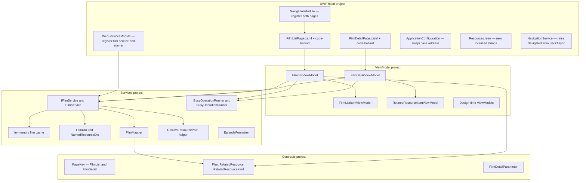
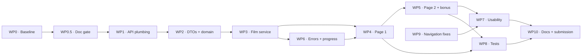
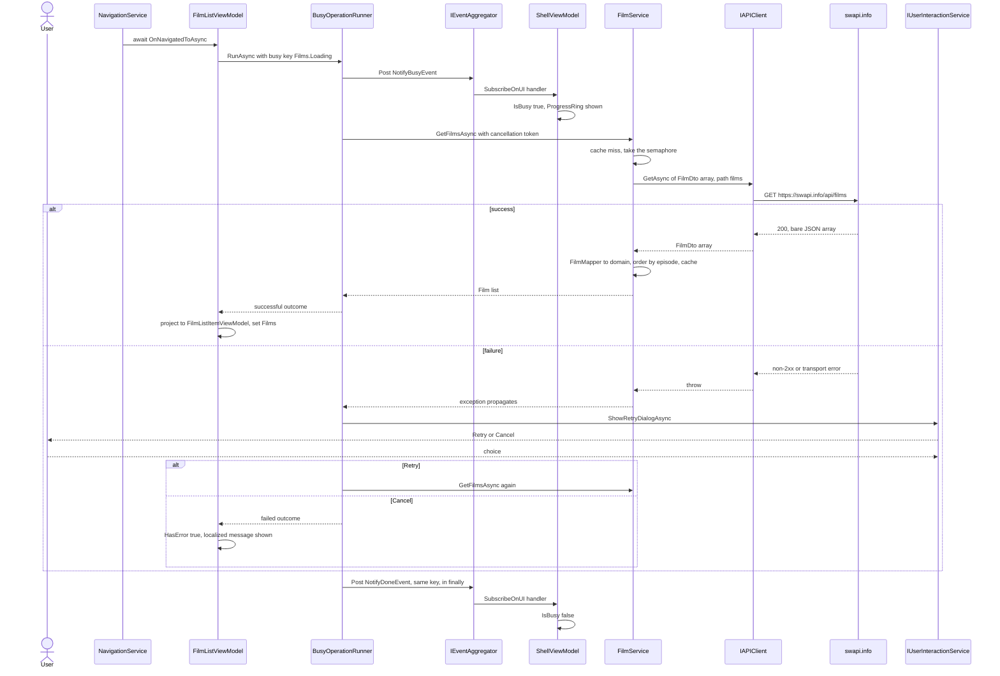
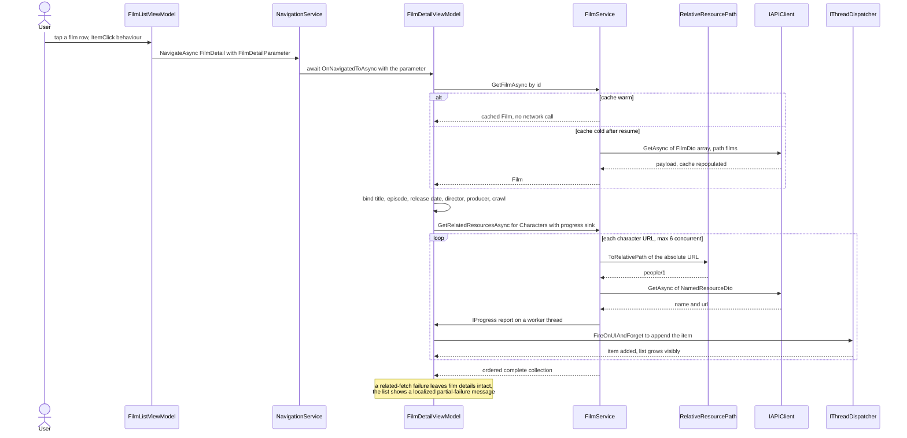

# Implementation Plan — Drawboard UWP Coding Exercise

A complete, sequenced plan to deliver every requirement in [README.md](README.md). Companion documents: [ARCHITECTURE.md](ARCHITECTURE.md) (how the scaffold works) and [CLAUDE.md](CLAUDE.md) (build/test commands and gotchas).

**Chosen option:** Option 1 — Star Wars films (swapi.info). Rationale and the Option 2 contingency are in §3 and §13.

**Mandatory across every change:** precise XML documentation on all new and modified types and members — see §5, which is a hard gate, not a style preference.

> **This document is the plan as written before implementation, kept unrevised.** Two things were decided differently once the code existed; both are recorded in [CHANGES.md](CHANGES.md) rather than edited into the plan above, so the two can be compared.
>
> 1. **`RelativeResourcePath` was superseded by `RequestUriResolver`** (CHANGES.md §1.6). The plan plugged the absolute-URL trap by converting URLs *before* calling the client. Review found the root cause was the client's string concatenation, which `Uri`'s base-relative constructor already handles correctly — so URI construction moved inside the client, `FilmService` stopped needing the base address, and the plan's separate helper stopped being a step in front of the client and became part of it.
> 2. **`EventAggregator` needed rewriting** (CHANGES.md §1.2). The plan treated it as sound scaffold code. It delivered messages to independent thread-pool consumers with no ordering guarantee, which the shell's progress indicator depends on. Found by running the app, not by the suite.
>
> Neither was foreseeable from reading alone, which is the honest argument for building and running before trusting a plan.

---

## 1. Scope — what "done" means

Traceability from each README requirement to the work package that satisfies it and the evidence that proves it.

| # | README requirement | Work package | Evidence of completion |
|---|---|---|---|
| R1 | Page 1 lists all films from the films endpoint | WP4 | Six films render; integration test asserts count and payload shape |
| R2 | Each list row shows title **and** episode number | WP4 | Unit test on item projection; visual check |
| R3 | Clicking a film navigates to Page 2 | WP4/WP5 | Unit test asserts `NavigateAsync(PageKey.FilmDetail, id)` |
| R4 | Page 2 shows title, episode number, release date, director, producer | WP5 | Unit test on detail projection; visual check |
| R5 | Page 2 shows a list of one related category (characters) | WP5 | Unit + integration tests on related-resource fetch |
| R6 | **Bonus** — opening crawl on Page 2 | WP5 | Visual check; crawl text present in projection test |
| R7 | Calls the REST API directly, no API-specific wrapper library | WP1–WP3 | Only `IAPIClient` + `HttpClient`; dependency diff in submission README |
| R8 | Solid design principles | WP2–WP6 | SOLID mapping table (§10) |
| R9 | Clean, well-factored code | all | Review checklist (§11); no ViewModel touches `HttpClient` or `Windows.*` |
| R10 | Testable **and** extensible architecture | WP2/WP3/WP8 | ViewModels tested with no UI host; adding a second API needs one new service |
| R11 | Project contains automated tests | WP8 | `dotnet test` green; test matrix (§9) |
| R12 | Error checking and reporting to the user | WP6 | Retry dialog tests; forced-failure manual scenarios |
| R13 | Usability for the user | WP7 | Busy indicator, empty/error states, keyboard + narrator pass |
| R14 | Code structure and current UWP idioms | WP4/WP5/WP7 | `x:Bind`, behaviours instead of code-behind handlers, `x:Uid` localization |
| R15 | Persistence not required | — | Explicit non-goal; in-memory cache only, stated in submission README |
| R16 | Submission README: limitations, extensions, considerations | WP10 | `SOLUTION.md` delivered |
| R17 | AI-agent collaboration: challenges faced, how code was validated | WP10 | `AI-COLLABORATION.md` delivered |
| R18 | Zip and send to hiring@drawboard.com | WP10 | Clean-clone build verified before zipping |

**Explicit non-goals:** persistence, authentication, offline mode, telemetry backend, localization beyond `en`, MET option (unless the contingency in §13 triggers).

---

## 2. Verified API facts

Confirmed against the live endpoints on 2026-08-12 rather than assumed — two of these change the design.

**`GET https://swapi.info/api/films`**

- Returns a **bare JSON array**, not a `{count, results}` envelope. Deserialize to `FilmDto[]` directly.
- Film fields are **snake_case**: `title`, `episode_id`, `opening_crawl`, `director`, `producer`, `release_date`, `characters`, `planets`, `starships`, `vehicles`, `species`, `created`, `edited`, `url`.
- `episode_id` is an integer; `release_date` is an ISO date string (`"1977-05-25"`).
- `characters` / `planets` / `starships` / `vehicles` / `species` are arrays of **absolute URLs** (`https://swapi.info/api/people/1`).
- The films response already contains every Page 2 detail field, including the opening crawl. **Page 2 needs no second call for film details** — only for the related-resource names.
- All five related resource types expose a `name` field, so one DTO shape covers every category.

**Consequences that drive the plan**

1. The camelCase contract resolver in `WebServicesModule` will not map snake_case. Every affected DTO property needs an explicit `[JsonProperty("episode_id")]`. (MET, by contrast, is already camelCase — `departmentId`, `displayName`, `objectID`.)
2. `IAPIClient` builds `{ServerAddress}/{path}`, so passing an absolute URL from `characters` produces `https://swapi.info/api/https://swapi.info/api/people/1`. A URL-to-relative-path conversion step is required (WP1).

---

## 3. Option choice

| Criterion | Option 1 — swapi | Option 2 — MET |
|---|---|---|
| Requests for Page 1 | 1 | 1 |
| Requests for Page 2 | 1 cached read + N related fetches | 1 id list + N object fetches |
| JSON naming vs the scaffold's resolver | snake_case, needs attributes | camelCase, works as-is |
| Images | none | thumbnails on `images.metmuseum.org` — a **different host** from the API, which `GetImageAsync` cannot reach without change |
| Bonus difficulty | low (crawl is already in the payload) | high (incremental paging over thousands of ids) |
| Uses the provided `StreamedImage` control | no | yes |

**Decision: Option 1.** It satisfies every mandatory requirement plus the bonus at materially lower risk, and the N-related-fetches problem still demonstrates bounded concurrency, caching, incremental UI population, and cancellation — the substance the evaluation is looking for. The `StreamedImage` control going unused is an acceptable, documented trade-off. Option 2 remains fully specified in §13 as an API-downtime contingency.

---

## 4. Target design

### 4.1 New components and their placement



### 4.2 Layer contracts

- **`.Contracts`** — domain models (`Film`, `RelatedResource`, `RelatedResourceKind`), the navigation parameter record, `PageKey` values, and the busy-runner abstraction. No JSON, no HTTP, no `Windows.*`.
- **`.Services`** — DTOs, mapping, HTTP orchestration, caching, formatting. Knows Newtonsoft and `IAPIClient`; knows nothing about UWP or ViewModels.
- **`.ViewModel`** — presentation state and commands over domain models. Never sees a DTO, an `HttpClient`, or a `Frame`.
- **UWP head** — XAML, DI registration, platform services.

The DTO-to-domain boundary is deliberate: it keeps snake_case JSON quirks out of the ViewModels and means swapping to MET (or a mock source) changes one service, not the UI.

### 4.3 Key design decisions

| Decision | Choice | Why |
|---|---|---|
| Page 1 / Page 2 data source | One `IFilmService` with an in-memory cache seeded by Page 1 | The films payload already contains all detail fields; Page 2 detail needs zero extra network calls |
| Navigation parameter | `FilmDetailParameter` record holding `int FilmId` | A value-type id survives back navigation replay; a cold cache is recoverable by re-fetch |
| Cold-cache handling on Page 2 | Service re-fetches the film list if the cache is empty | Page 2 stays correct after suspend/resume or a direct back-stack replay |
| Landing page | `FilmListPage` replaces `Welcome`; `PageA` and `PageAViewModel` are deleted | They are scaffolding demos with no role in the deliverable; removing them shows deliberate modification rather than accretion. Alternative considered: keep `Welcome` as a launcher — rejected as a pointless extra tap |
| Related-resource category | Characters, behind a `RelatedResourceKind` parameter | Meets R5 while making the other four categories a one-line change; an optional selector is a stretch item |
| Related-resource fetching | Bounded concurrency (max 6 in flight), per-URL cache, incremental UI population | Film 1 alone needs 18 person requests; unbounded `Task.WhenAll` risks throttling and a frozen-feeling list |
| Cancellation | Add optional `CancellationToken` to `IAPIClient` and every service method | Navigating away mid-load must abandon in-flight work; also makes tests deterministic |
| Busy/retry orchestration | Single `BusyOperationRunner` used by both ViewModels | Removes duplicated try/finally + retry-loop code and makes the busy/done pairing testable in one place |
| Mapping | Hand-written static mapper | Six fields; a Mapperly dependency would not pay for itself. Noted as an extension point |
| Error surface | Existing `HttpStatusException` plus `HttpRequestException`, both translated to localized messages | Reuses the scaffold's contract rather than inventing a parallel error model |

---

## 5. XML documentation standard (mandatory)

Every new or modified type, member, parameter, return value, and thrown exception carries XML documentation. This is a gate on each work package, not a cleanup pass at the end.

### 5.1 Rules

1. **Coverage:** every `public`, `internal`, and `protected` type and member. Private members get docs when the intent is not obvious from the signature.
2. **Content, not restatement:** `<summary>` states the contract and any behaviour a caller cannot infer — ordering, nullability, caching, thread affinity, side effects. "Gets or sets the title" adds nothing; say what the value means and where it comes from.
3. **`<param>` for every parameter, `<returns>` for every non-void return.** Document units, accepted ranges, and null handling.
4. **`<exception cref="..."/>` for every exception a caller can reasonably expect** — notably `HttpStatusException` and `HttpRequestException` on anything reaching the network, and `OperationCanceledException` where a token is honoured.
5. **`<typeparam>` on every generic type and method.**
6. **`<remarks>` for the non-obvious:** why a DTO needs `[JsonProperty]`, why a call must run on the UI thread, why a cache exists, why concurrency is bounded.
7. **`<see cref="..."/>` / `<paramref name="..."/>`** for cross-references so the docs survive renames; never spell type names in prose where a `cref` will do.
8. **`<inheritdoc/>` on interface implementations**, with an added `<remarks>` when the implementation has behaviour beyond the contract.
9. **`<value>` on properties** where the meaning of the value needs stating beyond the summary.
10. **Threading and cancellation are always documented** — the codebase has a UI-thread-affine navigation service and a dispatcher abstraction, so silence here is a defect.
11. **`[ObservableProperty]` fields:** document the backing field; the toolkit forwards the summary to the generated property. Verify the generated output under `obj/` if CS1591 fires, and document generated commands via the `<summary>` on the `[RelayCommand]` method.
12. **No stale docs:** modifying a member means updating its documentation in the same edit.

### 5.2 Enforcement

Add to each SDK-style project (`.Contracts`, `.Services`, `.ViewModel`):

```xml
<PropertyGroup>
  <!-- Emit the XML doc file and fail the build on any undocumented public member. -->
  <GenerateDocumentationFile>true</GenerateDocumentationFile>
  <WarningsAsErrors>$(WarningsAsErrors);CS1591</WarningsAsErrors>
</PropertyGroup>
```

For the legacy UWP csproj, add `<DocumentationFile>bin\$(Platform)\$(Configuration)\DrawboardCodingExercise.xml</DocumentationFile>` to each of the four `Configuration|Platform` property groups.

Turning CS1591 into an error surfaces pre-existing gaps in the scaffold (`IEventAggregator` members, `IThreadDispatcher` members, `IAPIClient` members, `PageKey` values, `IAPISettings`, `RetryDialogResult`, several converter and control members). Backfilling those is WP0.5 — a small, high-value task that also demonstrates engagement with the existing codebase. If the backfill runs long, downgrade to a warning and record it as a known gap rather than shipping undocumented new code.

### 5.3 Exemplars

These are the shapes to copy. A domain model:

```csharp
namespace DrawboardCodingExercise.Contracts.Model;

/// <summary>
/// An immutable projection of a single Star Wars film, mapped from the films endpoint payload.
/// </summary>
/// <remarks>
/// The films endpoint returns every field required by both the list and the detail page, including
/// <see cref="OpeningCrawl"/>. Detail views are therefore served from the cached list rather than
/// a second network call. Related-resource URLs are kept in their original absolute form; convert
/// them with <c>RelativeResourcePath.ToRelativePath</c> before passing them to
/// <see cref="Services.IAPIClient"/>.
/// </remarks>
/// <param name="Id">
/// The film's numeric identifier, parsed from the trailing segment of its resource URL. Used as the
/// navigation parameter for the detail page.
/// </param>
/// <param name="Title">The film's title, as supplied by the API.</param>
/// <param name="EpisodeNumber">
/// The episode number from <c>episode_id</c>. Released out of order, so this is not a sort key for
/// release chronology.
/// </param>
/// <param name="ReleaseDate">
/// The cinematic release date. <see langword="null"/> when the API omits or supplies an unparsable value,
/// in which case the UI shows a localized "unknown" placeholder rather than a default date.
/// </param>
/// <param name="Director">The credited director.</param>
/// <param name="Producer">
/// The credited producers as a single API-supplied string; may contain several names separated by commas.
/// </param>
/// <param name="OpeningCrawl">
/// The opening crawl text with line breaks normalized to <c>\n</c> for consistent XAML rendering.
/// </param>
/// <param name="RelatedResourceUrls">
/// Absolute resource URLs grouped by category. Empty categories are present with an empty collection
/// rather than omitted, so callers never need a null check.
/// </param>
public sealed record Film(
    int Id,
    string Title,
    int EpisodeNumber,
    DateTimeOffset? ReleaseDate,
    string Director,
    string Producer,
    string OpeningCrawl,
    IReadOnlyDictionary<RelatedResourceKind, IReadOnlyList<string>> RelatedResourceUrls);
```

A service contract:

```csharp
/// <summary>
/// Provides access to Star Wars film data, insulating callers from transport, JSON, and caching concerns.
/// </summary>
/// <remarks>
/// Implementations are registered as a single instance so the cache is shared across page navigations.
/// All members are safe to call from any thread and never marshal to the UI thread; callers are
/// responsible for dispatching UI updates via <see cref="Contracts.CoreFramework.IThreadDispatcher"/>.
/// </remarks>
public interface IFilmService
{
    /// <summary>
    /// Gets every film exposed by the API, ordered by <see cref="Film.EpisodeNumber"/>.
    /// </summary>
    /// <param name="cancellationToken">A token that abandons the request when navigation moves on.</param>
    /// <returns>
    /// The complete film collection. Served from cache when already retrieved; never <see langword="null"/>,
    /// and empty only if the API genuinely returns no films.
    /// </returns>
    /// <exception cref="Services.HttpStatusException">The API responded with a non-2xx status code.</exception>
    /// <exception cref="System.Net.Http.HttpRequestException">The request failed at the transport level.</exception>
    /// <exception cref="System.OperationCanceledException">
    /// <paramref name="cancellationToken"/> was signalled.
    /// </exception>
    Task<IReadOnlyList<Film>> GetFilmsAsync(CancellationToken cancellationToken = default);

    /// <summary>
    /// Gets a single film by identifier, populating the cache first if it is cold.
    /// </summary>
    /// <param name="filmId">The value carried by <see cref="Contracts.Navigation.FilmDetailParameter"/>.</param>
    /// <param name="cancellationToken">A token that abandons the request when navigation moves on.</param>
    /// <returns>The matching film, or <see langword="null"/> when no film has that identifier.</returns>
    /// <exception cref="Services.HttpStatusException">The API responded with a non-2xx status code.</exception>
    Task<Film?> GetFilmAsync(int filmId, CancellationToken cancellationToken = default);

    /// <summary>
    /// Resolves the display names of one category of resources related to a film.
    /// </summary>
    /// <param name="film">The film whose related URLs are resolved.</param>
    /// <param name="kind">The category to resolve, for example <see cref="RelatedResourceKind.Characters"/>.</param>
    /// <param name="progress">
    /// Optional sink reporting each resource as it arrives, so the UI can fill the list incrementally
    /// instead of waiting for the whole batch. Invoked on arbitrary threads.
    /// </param>
    /// <param name="cancellationToken">A token that abandons in-flight requests.</param>
    /// <returns>The resolved resources in the order the API listed their URLs.</returns>
    /// <remarks>
    /// One request per URL is unavoidable — the API exposes no batch endpoint. Concurrency is bounded
    /// to six in-flight requests to stay well inside the public API's tolerance, and results are cached
    /// per URL so revisiting a film costs nothing.
    /// </remarks>
    Task<IReadOnlyList<RelatedResource>> GetRelatedResourcesAsync(
        Film film,
        RelatedResourceKind kind,
        IProgress<RelatedResource>? progress = null,
        CancellationToken cancellationToken = default);
}
```

A DTO, where `<remarks>` carries the reason the attributes exist:

```csharp
/// <summary>
/// Wire format of a single film as returned by <c>GET /films</c>.
/// </summary>
/// <remarks>
/// The endpoint returns a bare JSON array of these objects. Field names are snake_case, which the
/// application's <c>CamelCasePropertyNamesContractResolver</c> does not map, so every multi-word member
/// declares an explicit <see cref="JsonProperty"/> name. This type is internal to the services layer;
/// callers consume <see cref="Contracts.Model.Film"/> instead.
/// </remarks>
internal sealed class FilmDto
{
    /// <summary>Gets or sets the film title.</summary>
    [JsonProperty("title")]
    public string Title { get; set; }

    /// <summary>Gets or sets the episode number, mapped from <c>episode_id</c>.</summary>
    [JsonProperty("episode_id")]
    public int EpisodeId { get; set; }
    // ... remaining members documented identically
}
```

A ViewModel member set:

```csharp
/// <summary>The films currently bound to the list, ordered by episode number.</summary>
[ObservableProperty]
private IReadOnlyList<FilmListItemViewModel> _films = Array.Empty<FilmListItemViewModel>();

/// <summary>
/// Navigates to the detail page for the selected film.
/// </summary>
/// <param name="film">
/// The tapped row. Ignored when <see langword="null"/>, which occurs when a selection is cleared.
/// </param>
/// <remarks>
/// Passes <see cref="Contracts.Navigation.FilmDetailParameter"/> rather than the film itself, so the
/// value replays correctly through <c>NavigationService.BackAsync</c>.
/// </remarks>
[RelayCommand]
private async Task OnFilmSelectedAsync(FilmListItemViewModel? film) { /* ... */ }
```

---

## 6. Work packages

Dependency order. Estimates assume familiarity with the scaffold and include writing tests and documentation.



### WP0 — Baseline and tooling (0.5 h)

**Goal:** prove the untouched scaffold builds, deploys, and tests green before changing anything.

- Build x64 Debug and run the app; confirm Welcome and PageA behave as shipped.
- `dotnet test` both test projects.
- Record the baseline in the AI-collaboration log (WP10).

**Acceptance:** app launches, both suites pass, commands captured.

### WP0.5 — Documentation gate (1 h)

**Goal:** make the XML doc standard enforceable from the first line of new code.

- Add `GenerateDocumentationFile` + `WarningsAsErrors` CS1591 to the three SDK-style projects; add `DocumentationFile` to the four UWP configurations.
- Backfill missing docs on the scaffold's public surface: `IEventAggregator`, `IThreadDispatcher`, `IAPIClient`, `IAPISettings`, `PageKey`, `RetryDialogResult`, `BoolToVisibilityConverter`, `StreamedImage` members, `NavigationService.Frame`/`CanGoBack`/`Navigated`.

**Acceptance:** all projects build with zero CS1591.

### WP1 — Configuration and API-client plumbing (1.5 h)

**Goal:** make the client usable against swapi's absolute URLs, with cancellation.

- `ApplicationConfiguration.ServerAddress` → `https://swapi.info/api/`. Document that this is a hardcoded stand-in for real configuration storage.
- Add `RelativeResourcePath` to `.Services`: converts an absolute resource URL to a path relative to a configured base, validating host and scheme. Throws a documented `ArgumentException` on a foreign host so a MET-style cross-host URL fails loudly rather than producing a malformed request.
- Extend `IAPIClient` and `APIClient` with `CancellationToken cancellationToken = default` on all three methods, threaded into `Client.SendAsync`. Preserves the existing signatures as defaults.
- Document the base-address contract: `ServerAddress` must end with the API root, and paths passed in are relative.

**Files:** `Configuration/ApplicationConfiguration.cs`, `.Services/IAPIClient.cs`, `.Services/APIClient.cs`, new `.Services/Api/RelativeResourcePath.cs`.

**Tests:** `RelativeResourcePath` — same host, trailing/leading slash combinations, foreign host throws, non-absolute input throws, query and fragment handling.

**Acceptance:** unit tests pass; a smoke integration test retrieves the films array.

### WP2 — DTOs, domain models, mapping (2 h)

**Goal:** a typed, tested boundary between wire format and domain.

- `.Services/Api/Dto/FilmDto.cs` — all snake_case fields with `[JsonProperty]`.
- `.Services/Api/Dto/NamedResourceDto.cs` — `name` + `url`, covering all five related categories.
- `.Contracts/Model/Film.cs`, `RelatedResource.cs`, `RelatedResourceKind.cs` (`Characters`, `Planets`, `Starships`, `Vehicles`, `Species`).
- `.Contracts/Navigation/FilmDetailParameter.cs` — record carrying `int FilmId`.
- `.Services/Mapping/FilmMapper.cs` — DTO to domain: parse `Id` from the trailing URL segment, parse `release_date` tolerantly (null on failure, never throw), normalize `\r\n` to `\n` in the crawl, group related URLs by kind, defend against null arrays from the API.

**Tests:** deserialize a checked-in sample payload and assert every field maps; malformed/missing date yields null; missing arrays yield empty collections; id parsing handles trailing slashes.

**Acceptance:** mapping tests green; no DTO type is visible outside `.Services`.

### WP3 — Film service with caching and bounded concurrency (2.5 h)

**Goal:** one place that owns film retrieval, caching, and fan-out.

- `IFilmService` in `.Contracts/Services`, `FilmService` in `.Services`, registered `SingleInstance` in `WebServicesModule`.
- Film-list cache guarded by `SemaphoreSlim` so concurrent page loads produce one network call.
- `GetFilmAsync` populates a cold cache before lookup.
- `GetRelatedResourcesAsync`: map absolute URLs to relative paths, fetch with max 6 concurrent requests, cache per URL, report each result through `IProgress<RelatedResource>`, preserve API ordering in the returned list, honour cancellation.

**Tests:** with a substituted `IAPIClient` — one network call for two consecutive list requests; cold-cache detail lookup triggers a fetch; unknown id returns null; related fetch preserves order, reports progress per item, never exceeds the concurrency cap, propagates `HttpStatusException`, and stops promptly on cancellation.

**Acceptance:** all service tests green; ViewModels can be written against the interface alone.

### WP4 — Page 1, the film list (2.5 h)

**Goal:** R1–R3.

- `FilmListViewModel` : `ObservableObject`, `INavigateToAware`, `IProvidePageHeader` — loads via the busy runner (WP6), exposes `Films`, `IsEmpty`, `HasError`, and a `FilmSelected` command that navigates with `FilmDetailParameter`.
- `FilmListItemViewModel` — title plus a formatted episode label; `EpisodeFormatter` renders Roman numerals ("Episode IV") with a unit-tested fallback to digits outside I–XX.
- `FilmListPage.xaml` — `ListView` with `x:Bind` compiled bindings in the item template, `IsItemClickEnabled`, and `ItemClick` routed to the command via `Microsoft.Xaml.Behaviors` (`EventTriggerBehavior` + `InvokeCommandAction`) so no event handler lands in code-behind.
- Register `PageKey.FilmList` in `NavigationModule`; add `<Page>` and `<Compile>` entries to the csproj; add `PageHeader.FilmList.Text` and item strings to the resw; point `ShellViewModel.OnNavigatedToAsync` at `PageKey.FilmList`; delete `Welcome`, `PageA`, their ViewModels, their csproj entries, their `PageKey` values, and their resw strings.

**Tests:** `OnNavigatedToAsync` populates `Films` in episode order; a service failure sets `HasError` and leaves the collection empty; an empty payload sets `IsEmpty`; selecting an item calls `NavigateAsync(PageKey.FilmDetail, FilmDetailParameter)` with the right id; a null selection is a no-op; `EpisodeFormatter` covers 1–20 plus out-of-range.

**Acceptance:** six films render with title and episode number; tapping one navigates.

### WP5 — Page 2, film detail plus bonus (3 h)

**Goal:** R4–R6.

- `FilmDetailViewModel` : `ObservableObject`, `INavigateToAware`, `IProvidePageHeader` — reads `FilmDetailParameter`, resolves the film from `IFilmService`, exposes title, episode label, formatted release date, director, producer, `OpeningCrawl`, and an `ObservableCollection<RelatedResourceItemViewModel>` filled incrementally through `IProgress<T>` marshalled by `IThreadDispatcher`.
- Handle the film-not-found case with a localized message rather than an empty page.
- `FilmDetailPage.xaml` — header block of labelled fields, the opening crawl in a `ScrollViewer` with `TextWrapping="Wrap"` and a monospaced-adjacent style, and the characters `ListView` with its own inline progress affordance while items stream in.
- Register `PageKey.FilmDetail`; csproj entries; resw strings for every field label, the crawl heading, the characters heading, the unknown-date placeholder, and the not-found message.

**Tests:** parameter is honoured; unknown id yields the not-found state; related items append in order as progress reports arrive; a related-fetch failure still renders the film's own details (partial success is not total failure); null release date renders the placeholder; `PageHeader` returns the resw key fragment.

**Acceptance:** all five detail fields plus the crawl and the characters list render for every film.

### WP6 — Error handling, retry, progress (2 h)

**Goal:** R12, and the busy indicator wired correctly everywhere.

- `IBusyOperationRunner` in `.Contracts/Services`; `BusyOperationRunner` in `.Services`. `RunAsync` posts `NotifyBusyEvent`, executes the operation, and in a `finally` posts the matching `NotifyDoneEvent` with the identical string. On `HttpStatusException` / `HttpRequestException` it logs, calls `IUserInteractionService.ShowRetryDialogAsync`, and loops on `Retry` or returns a failed outcome on `Cancel`. Returns an outcome type rather than throwing, so ViewModels stay branch-simple.
- Map status ranges to distinct localized messages (offline/transport, 404, 429, 5xx, generic) and extend the resw accordingly; document that the scaffold's single `Errors.Retry` string is deliberately superseded.
- Harden `ShellViewModel.OnNotifyDone` against the unmatched-Done crash: guard `IndexOf` returning `-1` and log the mismatch instead of throwing.
- Guarantee the Busy/Done pairing lives only inside the runner, so no ViewModel can post one without the other.

**Tests:** success posts exactly one Busy and one Done with equal strings; failure then Retry re-invokes the operation and still posts one Done; failure then Cancel returns a failed outcome; an unexpected exception type is not swallowed; `ShellViewModel` tolerates an unmatched Done and keeps `IsBusy` consistent; nested/concurrent operations aggregate correctly.

**Acceptance:** with the base address pointed at an unreachable host, both pages show the retry dialog, recover on Retry, and degrade cleanly on Cancel; the progress ring always clears.

### WP7 — Usability, accessibility, polish (2 h)

**Goal:** R13, R14.

- Empty state, error state, and loading state for both lists — distinct and localized, never a blank page.
- Keyboard: `ListView` arrow/Enter activation, sensible tab order, visible focus.
- `AutomationProperties.Name`/`LabeledBy` on interactive and image-free icon elements; verify with Narrator.
- Light/dark theme check via `ThemeResource` only; no hardcoded colours.
- Narrow-window layout check (`RelativePanel`/adaptive triggers) at ~320 epx.
- Design-time ViewModels for both new pages so the designer renders.
- Cancel in-flight loads when navigating away: hold a `CancellationTokenSource` per page load and cancel it on the next navigation.
- Optional stretch: a category selector on Page 2 over `RelatedResourceKind`.

**Acceptance:** manual pass on the checklist in §11 with no blank/dead states.

### WP8 — Test suite completion (2 h)

**Goal:** R11 — see the matrix in §9.

- New `DrawboardCodingExercise.ViewModel.UnitTests` project (net8.0, xUnit + Shouldly + NSubstitute + coverlet), referencing `.ViewModel` and `.Services`, added to `DrawboardCodingExercise.slnx`.
- Shared test doubles: `ImmediateThreadDispatcher` (runs callbacks inline, reports `OnUIThread` true) for deterministic dispatch, and a recording event aggregator for busy/done assertions.
- Populate `.Services.IntegrationTests` with real-network tests behind `[Trait("Category", "Integration")]`: films endpoint returns a bare array of six with non-empty crawls; a person URL resolves to a named resource; a bad path yields `HttpStatusException`.
- Document the filter for excluding network tests: `dotnet test --filter "Category!=Integration"`.
- Capture a coverage run and note the figure in the submission README.

**Acceptance:** `dotnet test` green offline with the integration filter applied, and green online without it.

### WP9 — Navigation fixes (0.5 h)

**Goal:** correctness in the framework the pages depend on.

- Raise `Navigated` from `NavigationService.BackAsync` so `ShellViewModel` refreshes `CanGoBack` and `GoBackCommand` — currently the back button's enabled state is stale after a back navigation until the next forward navigation.
- Verify the shell's back button `Visibility` binding: it binds `CanGoBack` (a `bool`) straight to `Visibility` without the available `BoolToVisibilityConverter`. Apply the converter.
- Document the instance-per-dependency ViewModel lifetime consequence in code comments where the cache compensates for it.

**Tests:** a `BackAsync` unit test asserting `Navigated` fires; converter binding verified manually.

**Acceptance:** back button enables/disables correctly through a full forward-and-back cycle.

### WP10 — Submission documentation and packaging (1.5 h)

**Goal:** R16, R17, R18.

- `SOLUTION.md`: what was built, the design decisions from §4.3 with their trade-offs, **limitations** (no persistence, no offline mode, `en` only, hardcoded base address, one related category by default, `StreamedImage` unused under Option 1, N+1 related-resource calls with no batch endpoint available, integration tests need network), **how to extend** (category selector, virtualized incremental loading, image support via a cross-host-capable client, Polly-style retry/backoff, MET as a second `IFilmService`-shaped source, persistence via a cache layer behind the same interface), and **important considerations** (UWP runtime ceiling and PolySharp, UI-thread affinity, public-API rate limits, correlation-id logging).
- `AI-COLLABORATION.md`: the challenges the agent hit and how they were resolved — legacy csproj files not globbing; the camelCase resolver versus snake_case payloads; `IAPIClient` mangling absolute URLs; MET images living on a second host; the unmatched-`NotifyDoneEvent` crash; `Navigated` not firing on back navigation — plus **how the output was validated**: live endpoint verification before writing DTOs, unit tests written against the interface first, forced-failure manual testing, both-platform builds, and a full read-through review pass.
- Verify from a clean copy: fresh clone, restore, build x64 **and** ARM64, `dotnet test`, deploy, smoke test.
- Zip excluding `bin`, `obj`, `.vs`, `AppPackages`, `BundleArtifacts`; send to hiring@drawboard.com.

**Acceptance:** a clean-clone build and test pass, both docs complete, archive verified by extracting to a new folder.

**Total: ~21 h**, of which ~5 h is tests and ~2.5 h documentation.

---

## 7. New runtime flows

### 7.1 Page 1 load



### 7.2 Page 2 with incremental related resources



---

## 8. File-by-file change inventory

| Project | Path | Action |
|---|---|---|
| `.Contracts` | `PageKey.cs` | Modify — add `FilmList`, `FilmDetail`; remove `Welcome`, `PageA` |
| `.Contracts` | `Model/Film.cs`, `Model/RelatedResource.cs`, `Model/RelatedResourceKind.cs` | New |
| `.Contracts` | `Navigation/FilmDetailParameter.cs` | New |
| `.Contracts` | `Services/IFilmService.cs`, `Services/IBusyOperationRunner.cs`, `Services/OperationOutcome.cs` | New |
| `.Contracts` | `Services/IEventAggregator.cs`, `CoreFramework/IThreadDispatcher.cs` | Modify — doc backfill |
| `.Contracts` | `DrawboardCodingExercise.Contracts.csproj` | Modify — doc generation properties |
| `.Services` | `Api/RelativeResourcePath.cs` | New |
| `.Services` | `Api/Dto/FilmDto.cs`, `Api/Dto/NamedResourceDto.cs` | New |
| `.Services` | `Mapping/FilmMapper.cs`, `Formatting/EpisodeFormatter.cs` | New |
| `.Services` | `FilmService.cs`, `BusyOperationRunner.cs` | New |
| `.Services` | `IAPIClient.cs`, `APIClient.cs` | Modify — cancellation tokens, doc backfill |
| `.Services` | `DrawboardCodingExercise.Services.csproj` | Modify — doc generation properties |
| `.ViewModel` | `FilmListViewModel.cs`, `FilmDetailViewModel.cs` | New |
| `.ViewModel` | `Items/FilmListItemViewModel.cs`, `Items/RelatedResourceItemViewModel.cs` | New |
| `.ViewModel` | `DesignTime/DesignTimeFilmListViewModel.cs`, `DesignTime/DesignTimeFilmDetailViewModel.cs` | New |
| `.ViewModel` | `ShellViewModel.cs` | Modify — navigate to `FilmList`; harden `OnNotifyDone` |
| `.ViewModel` | `WelcomeViewModel.cs`, `PageAViewModel.cs` | Delete |
| `.ViewModel` | `DrawboardCodingExercise.ViewModel.csproj` | Modify — doc generation properties |
| UWP | `View/FilmListPage.xaml` + `.cs`, `View/FilmDetailPage.xaml` + `.cs` | New |
| UWP | `View/Welcome.xaml` + `.cs`, `View/PageA.xaml` + `.cs` | Delete |
| UWP | `Module/NavigationModule.cs` | Modify — register both pages, drop the old two |
| UWP | `Module/WebServicesModule.cs` | Modify — register `IFilmService`, `IBusyOperationRunner` |
| UWP | `Configuration/ApplicationConfiguration.cs` | Modify — swapi base address |
| UWP | `CoreFramework/NavigationService.cs` | Modify — raise `Navigated` from `BackAsync` |
| UWP | `View/Shell.xaml` | Modify — back-button visibility through the converter |
| UWP | `Strings/en/Resources.resw` | Modify — new keys, remove obsolete ones |
| UWP | `DrawboardCodingExercise.csproj` | Modify — add/remove `<Page>` and `<Compile>` entries, `DocumentationFile` |
| Tests | `DrawboardCodingExercise.ViewModel.UnitTests/` | New project, added to `.slnx` |
| Tests | `.Services.UnitTests/`, `.Services.IntegrationTests/` | Modify — replace placeholders with real tests, add shared doubles |
| Root | `SOLUTION.md`, `AI-COLLABORATION.md` | New |

**Reminder:** every UWP file addition or deletion requires the matching `<Compile>` / `<Page>` edit — the legacy csproj does not glob.

---

## 9. Test matrix

| Area | Level | Project | Doubles | Key assertions |
|---|---|---|---|---|
| `RelativeResourcePath` | Unit | Services.UnitTests | none | Slash combinations; foreign host throws; relative input throws |
| `FilmMapper` | Unit | Services.UnitTests | checked-in sample JSON | Every field maps; bad date to null; null arrays to empty; id parsed from URL |
| `EpisodeFormatter` | Unit | Services.UnitTests | none | 1–20 Roman numerals; out-of-range falls back to digits |
| `FilmService` caching | Unit | Services.UnitTests | `IAPIClient` substitute | Two list calls, one request; cold-cache detail fetch; unknown id null |
| `FilmService` fan-out | Unit | Services.UnitTests | `IAPIClient` substitute | Order preserved; progress per item; concurrency cap respected; cancellation honoured |
| `BusyOperationRunner` | Unit | Services.UnitTests | aggregator + `IUserInteractionService` substitutes | Busy/Done paired and equal; Retry re-invokes; Cancel returns failure |
| `FilmListViewModel` | Unit | ViewModel.UnitTests | `IFilmService`, runner, `INavigationService` | Populates in order; error and empty states; navigates with the right id |
| `FilmDetailViewModel` | Unit | ViewModel.UnitTests | `IFilmService`, `ImmediateThreadDispatcher` | All five fields plus crawl; incremental appends; not-found state; partial failure |
| `ShellViewModel` | Unit | ViewModel.UnitTests | recording aggregator | Busy aggregation; unmatched Done tolerated; `CanGoBack` refresh |
| Films endpoint | Integration | Services.IntegrationTests | real network | Bare array of six; non-empty crawls; absolute related URLs |
| Person endpoint | Integration | Services.IntegrationTests | real network | A person URL resolves to a named resource |
| Bad path | Integration | Services.IntegrationTests | real network | `HttpStatusException` with the expected status |
| Views, converters, `StreamedImage` | Manual | — | — | Not reachable from net8.0 hosts; covered by the §11 checklist |

Convention: `MethodOrScenario_Condition_ExpectedOutcome`, arrange/act/assert, Shouldly assertions, NSubstitute for interface doubles, hand-written doubles where determinism matters more than terseness.

---

## 10. Design principles mapping

| Principle | How it is satisfied |
|---|---|
| **S**ingle responsibility | `RelativeResourcePath` converts URLs; `FilmMapper` maps; `FilmService` retrieves and caches; `BusyOperationRunner` orchestrates progress and retry; ViewModels only shape state for binding |
| **O**pen/closed | `RelatedResourceKind` adds a category without touching the fetch logic; a new `PageKey` + `RegisterView` adds a page without changing `NavigationService` |
| **L**iskov | `IFilmService` implementations are interchangeable; test doubles substitute cleanly with no behavioural special-casing |
| **I**nterface segregation | `INavigateToAware` and `IProvidePageHeader` stay opt-in and single-method rather than merging into a page base class; `IFrameNavigator` exposes only the frame setter |
| **D**ependency inversion | Every ViewModel depends on `.Contracts` abstractions; platform implementations are injected by Autofac from the head project |
| Separation of concerns | DTOs never cross out of `.Services`; `Windows.*` never crosses into `.ViewModel` |
| Don't repeat yourself | One busy/retry runner shared by both pages; one DTO shape for all five related categories |
| Fail fast, degrade gracefully | `RelativeResourcePath` throws on a foreign host; user-facing failures become retry prompts, never crashes |
| Testability by construction | No `static`/singleton access in new code paths; time, threading, and transport all injected |

---

## 11. Manual verification checklist

Run before packaging, on x64 and once on ARM64.

**Functional:** six films listed with title and episode; each film's detail page shows all five fields plus crawl and characters; back returns to the list with the back button correctly enabled, then disabled at the root; rapid repeated taps do not double-navigate; navigating away mid-load cancels cleanly with no orphaned progress ring.

**Failure paths:** base address pointed at an unreachable host shows the retry dialog; Retry recovers once the address is corrected; Cancel leaves a readable error state; airplane mode mid-load surfaces a transport message, not a crash; a 404 path yields the mapped message.

**Usability and accessibility:** progress ring appears and always clears; empty and error states are distinct and localized; full keyboard traversal with visible focus and Enter activation; Narrator announces list items and headings; light and dark themes both legible; window narrowed to ~320 epx stays usable; long producer strings and the crawl wrap without clipping.

**Code review:** no `Windows.*` in `.ViewModel` or `.Services`; no `HttpClient` outside `APIClient`; no DTO outside `.Services`; no `async void` except UWP event handlers; every `NotifyBusyEvent` paired inside the runner; all new files present in the csproj; zero CS1591; no hardcoded user-facing strings outside the resw.

---

## 12. Risks and mitigations

| Risk | Likelihood | Impact | Mitigation |
|---|---|---|---|
| swapi.info unavailable during development or review | medium | high | Checked-in sample payloads keep unit tests offline; integration tests are trait-filtered; §13 contingency is pre-specified |
| Rate limiting on N related-resource requests | medium | medium | Concurrency capped at 6, per-URL caching, retry dialog on 429 with a distinct message |
| Legacy csproj entries forgotten after adding files | high | medium | Explicit csproj step in every work package; the build fails loudly, and the §11 checklist re-verifies |
| snake_case fields silently deserializing to defaults | medium | high | Mapping tests against a real captured payload rather than a hand-written fixture |
| Absolute URLs passed straight to `IAPIClient` | high | high | `RelativeResourcePath` is the only sanctioned path, and it throws on misuse |
| ViewModel rebuilt on back navigation causing a visible re-fetch | high | low | Service-level cache makes back navigation instant; documented as intentional |
| Unmatched `NotifyDoneEvent` crashing the shell | medium | high | Pairing confined to the runner plus a defensive guard in `ShellViewModel`, both covered by tests |
| CS1591-as-error stalling progress on scaffold gaps | low | low | WP0.5 backfills first; downgrade to warning and record as a known gap if it overruns |
| ARM64-only build breakage found late | low | medium | Both platforms built in WP10 before packaging |
| UWP runtime ceiling rejecting a chosen package | low | medium | Prefer netstandard2.0 packages; the plan adds no new runtime dependencies |

---

## 13. Contingency — switching to Option 2 (MET)

If swapi is unavailable, the layered design means the swap is contained. Deltas:

1. **Base address** → `https://collectionapi.metmuseum.org/public/collection/v1/`.
2. **No `[JsonProperty]` attributes needed** — MET is already camelCase (`departmentId`, `displayName`, `objectID`), so the existing resolver maps it. `objectID` may still need an explicit attribute because of the unusual `ID` casing.
3. **Page 1** lists departments from `GET /departments`, which returns an object envelope `{ "departments": [ { departmentId, displayName } ] }` — an envelope DTO, unlike swapi's bare array.
4. **Page 2** calls `GET /objects?departmentIds={id}` for the id list, then one `GET /objects/{id}` per object for `title`, `culture`, `period`, `primaryImageSmall`. Cap the initial page at 50 as the README allows.
5. **Thumbnails are the significant blocker.** `primaryImageSmall` points at `https://images.metmuseum.org/...`, a **different host** from the API. `IAPIClient.GetImageAsync` prefixes `ServerAddress`, so it cannot fetch them. Add an `IImageClient` abstraction with its own absolute-URL-capable `HttpClient`, keeping `IAPIClient` untouched; feed its `Stream` into the provided `StreamedImage` control, and add a bounded in-memory image cache to avoid refetching on scroll.
6. **Bonus (all objects)** — incremental loading over the full id list: `ListView` with `ContainerContentChanging` or an `ISupportIncrementalLoading` collection, fetching in pages of ~50 with bounded concurrency and cancellation on navigation away.
7. **Unchanged:** navigation, busy/retry runner, error handling, documentation standard, test structure. Roughly +3 h over Option 1, mostly image handling and incremental loading.

---

## 14. Definition of done

- [ ] All 18 requirements in §1 satisfied, each with its stated evidence
- [ ] Zero CS1591 across all projects; every new and modified member carries XML documentation meeting §5
- [ ] `dotnet test` green offline (integration filtered) and online (unfiltered); coverage figure recorded
- [ ] x64 **and** ARM64 Debug builds succeed from a clean clone
- [ ] §11 manual checklist fully passed
- [ ] No `Windows.*` reference in `.ViewModel` or `.Services`; no DTO escapes `.Services`
- [ ] All user-facing strings localized through the resw
- [ ] `SOLUTION.md` and `AI-COLLABORATION.md` complete
- [ ] Archive verified by extracting to a clean folder and rebuilding, then sent to hiring@drawboard.com
