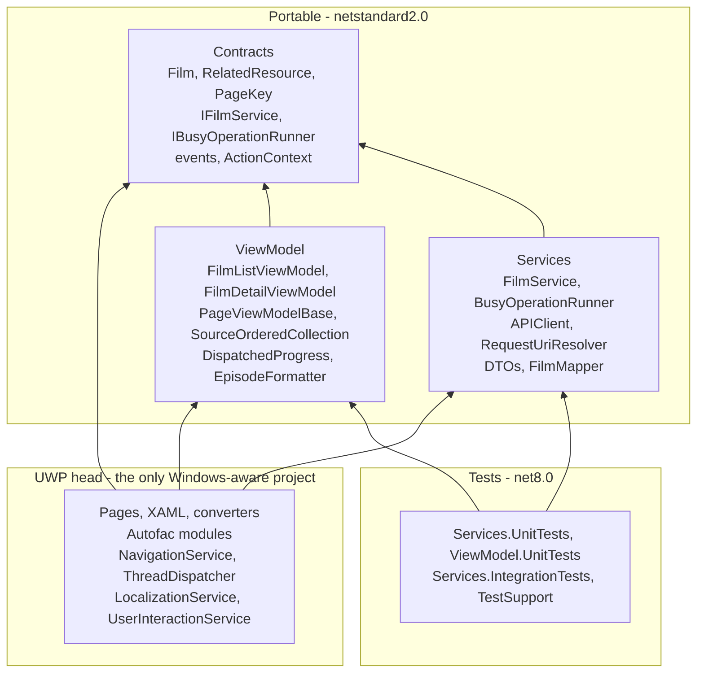

# Implementation Overview

A two-page UWP application built on the supplied Drawboard scaffold, driven by the Star Wars films API at [swapi.info](https://swapi.info): a film list page, and a detail page showing a selected film's fields, its characters, and the **bonus opening crawl**.

**Verified state:** 141 tests passing (73 service, 63 ViewModel, 5 against the live API). Zero warnings on x64 Debug and ARM64 Release. Installed and exercised on Windows 11 — every functional requirement confirmed on screen, not merely compiled.

This document is the single reference for the implementation. See §7 for the two supporting documents.

---

## 1. Starting Point

The work began by documenting rather than coding. [CLAUDE.md](CLAUDE.md) was generated first to capture the supplied scaffold — its build commands, project layout and traps — then the scaffold's runtime flows were mapped, then a plan was written, and only then was code changed. Reading first is what surfaced the constraints below, and three latent defects (§2).

**What the brief asked for** ([README.md](README.md)): two pages driven by a public API, called **directly** through the provided `IAPIClient` rather than an API-specific wrapper library; automated tests; error reporting to the user; solid, testable, extensible design following UWP idiom. No persistence required.

**Constraints that shaped every decision:**

- **Only the UWP head project may reference `Windows.*`.** This is what allows 63 ViewModel tests to run with no UI host, and it is enforced by project references rather than convention.
- **The UWP project file does not glob.** Every added or removed `.cs` and `.xaml` must be listed by hand in `<Compile>` / `<Page>` groups. Missing entries fail as unresolved-type or missing-`InitializeComponent` errors that point nowhere near the cause.
- **UWP's runtime is roughly .NET Core 2.1.** Newer BCL types are unavailable beyond what PolySharp polyfills, so packages must target netstandard2.0.
- **`dotnet build` cannot build the app.** The legacy non-SDK project needs Visual Studio's MSBuild and the WindowsXaml targets.

Option 1 (films) was chosen over the MET collection because its payload already contains every field the detail page needs, and because MET thumbnails are served from a *different host* than its API — which the single-origin client cannot reach by design (§5).

---

## 2. Challenges and Issues

**The assumed API schema was wrong.** Writing data transfer objects from prior knowledge of this API would have produced an envelope shape (`{count, results}`); the endpoint actually returns a **bare JSON array**, with **snake_case** field names the camel-case contract resolver does not map, and related resources given as **absolute URLs**. Fetching the live endpoints before writing any mapped type changed all three parts of the design. The lesson applied throughout: verify the external contract, do not recall it.

**`APIClient` built URLs by string concatenation.** Correct for relative paths, but an absolute URL from a payload became `{base}/https://host/path` — a 404 that reads like a server fault. The first fix converted URLs *before* calling the client; review found that treated the symptom, since `Uri`'s base-relative constructor already resolves both forms. URI construction moved **into** the client, and `FilmService` stopped needing to know the API's address at all.

**`EventAggregator` delivered messages out of order.** Each subscription owned an independent thread-pool consumer, so a completion notification could overtake its own busy notification — leaving the shell's progress indicator visibly stuck with stale text. Rewritten for ordered synchronous fan-out. **Found by running the app**, not by the 97 tests passing at the time.

**`ShellViewModel` could crash the application.** An unmatched completion did `RemoveAt(IndexOf(...))`, and `IndexOf` returns `-1` — throwing on the UI thread from an event handler, which is unrecoverable. Guarding it stopped the crash and, unhelpfully, converted it into the silent stuck indicator above. It also prompted a design decision rather than just a patch: the busy/done pairing was confined to one runner so no caller can get it wrong.

**A leak introduced by the design itself.** Making `PageViewModelBase` implement `IDisposable` looked obviously correct, but Autofac retains disposable components resolved from the root container — so every page ViewModel ever created became unreachable yet uncollectable, growing with navigation. Fixed with `ExternallyOwned()` on the ViewModel registrations. Everything compiled and every test passed both before and after.

**An ordering sentinel bug caught by a test.** Character responses arrive out of order and each row is placed at its API-listed position; `-1` was used for "not listed", and `-1` sorts *before* everything, so an unexpected item jumped to the front. Fixed with `int.MaxValue`. The test that caught it was written for a defensive branch expected never to be taken.

**Two findings worth recording separately:**

- The integration test project had **no xUnit runner adapter**, so its tests were never discovered and it reported success regardless. A green suite is only evidence if the tests actually execute.
- The synchronous test double was **more reliable than production**. Every ViewModel and runner test passed against ordering guarantees the real aggregator never made — coverage was not the weakness, the double's assumptions were, which is far harder to notice.

---

## 3. Architecture

Dependencies point strictly inward. Only the UWP head touches the platform.

| Layer | Owns |
|---|---|
| `.Contracts` | Domain model, `PageKey`, navigation parameter, service interfaces. No JSON, no HTTP, no platform. |
| `.Services` | HTTP orchestration, caching, DTOs and mapping, progress/retry. Knows Newtonsoft; knows nothing of UWP. |
| `.ViewModel` | Presentation state and commands over domain models. Never sees a DTO, an `HttpClient` or a `Frame`. |
| UWP head | XAML, DI registration, platform services. |

Data transfer objects never leave the services layer, and ViewModels never see JSON or a frame — both enforced by the compiler.

### Design decisions worth discussing

**The detail page makes no network call for the film.** The films endpoint returns every field it displays, including the crawl, so `FilmService` caches the list and serves details from it. That also compensates for the framework rebuilding page ViewModels on *every* navigation — back navigation is instant rather than a re-fetch. Nothing expires; the cache dies with the process, which is correct for immutable film data and would be wrong for volatile data.

**One place owns progress and retry.** `BusyOperationRunner` posts the busy notification, runs the work, prompts for retry on a recoverable failure, and posts the matching completion in a `finally`. The shell matches the pair by text, so an unpaired notification would spin forever; confining it to one class makes that impossible by construction and testable in one place. It returns an outcome rather than throwing, so ViewModels branch instead of catching.

**Navigation carries an identifier, not an object.** `FilmDetailParameter(int FilmId)` replays cleanly through the frame's back stack, and a cold cache stays recoverable.

**Character requests are bounded and ordered.** One film needs up to eighteen requests and the API has no batch endpoint, so concurrency is capped at six with per-URL caching. Rows are inserted at their API-listed position as responses arrive, so the list is ordered from the first row rather than reshuffling while it fills.

### SOLID in practice

| Principle | Where |
|---|---|
| Single responsibility | `RequestUriResolver` builds URIs; `FilmMapper` maps; `FilmService` retrieves and caches; `BusyOperationRunner` orchestrates progress and retry; ViewModels only shape state for binding. |
| Open/closed | `RelatedResourceKind` adds a category without touching retrieval; a new `PageKey` plus `RegisterView` adds a page without changing `NavigationService`. |
| Liskov | `IFilmService` implementations and test doubles substitute with no behavioural special-casing. |
| Interface segregation | `INavigateToAware` and `IProvidePageHeader` are single-method opt-ins, not a mandatory page base class; `IFrameNavigator` exposes only a frame setter. |
| Dependency inversion | ViewModels depend only on `.Contracts` abstractions; platform implementations are injected from the head project. |

---

## 4. Implementation Flow

Four flows cover the whole application. Each is documented with a **sequence diagram and an ordered breakpoint table** (method, purpose, file and line) in [CHANGES.md](CHANGES.md) §0.5 — use those when stepping through code.

**Startup → first film on screen.** `App.OnLaunched` builds the Autofac container, resolving every `Autofac.Module` in the assembly. It resolves `Shell` — whose constructor hands its `Frame` to the navigation service — then `ShellViewModel`, and calls its navigated-to hook directly, because the shell hosts the frame rather than living inside it. That subscribes to the progress events and navigates to `PageKey.FilmList`. `NavigationService` resolves the page type and ViewModel by that one key, drives the frame, assigns `DataContext`, then awaits the ViewModel's hook — which loads films through the runner and projects them into rows.

**Clicking a film.** The list's `ItemClick` reaches the ViewModel through a XAML behaviour and a converter that extracts the clicked row, so no event handler lives in code-behind. The detail ViewModel resolves the film from cache (no request), binds its fields, then runs the character load as a **separate** guarded operation — which is why a failed character list still leaves the film's details on screen. Each character resolves through the bounded fan-out and is marshalled to the UI thread before being placed in order.

**Failure and retry.** A non-2xx response becomes `HttpStatusException` inside the client. The runner classifies it, maps the status to one of five localized messages so the user can tell being offline from a server fault, and prompts. Retry re-runs the operation; cancel returns a failed outcome the page renders quietly. Unrecognised exceptions propagate deliberately rather than hiding a defect behind a dialog.

**Back navigation.** The navigation service reads the back-stack entry, replays its original parameter, and raises `Navigated` — which both refreshes the shell's back button and signals the departing page to cancel its in-flight work. A **new** ViewModel instance is then constructed and reloaded from cache.

---

## 5. Changes Implemented

Grouped by intent. The file-by-file inventory with line references is in [CHANGES.md](CHANGES.md) §1–§4.

**Domain and service layer.** `Film`, `RelatedResource`, `RelatedResourceKind` and `FilmDetailParameter` in `.Contracts`; `FilmService` (caching, bounded fan-out, progress), `BusyOperationRunner` (progress and retry), `FilmDto` / `NamedResourceDto`, `FilmMapper`, `RequestUriResolver` and `ApiSerializerSettings` in `.Services`. DTOs carry explicit `[JsonProperty]` names because the camel-case resolver does not map snake_case.

**Pages and ViewModels.** `FilmListPage` and `FilmDetailPage` with empty code-behind; `FilmListViewModel`, `FilmDetailViewModel`, immutable row ViewModels, and design-time ViewModels so the XAML designer renders. `Welcome` and `PageA` were removed along with their ViewModels, `PageKey` values and resources.

**Reusable infrastructure**, all generic and all reused by any future page: `PageViewModelBase` (cancels a page's work when the user navigates away, inferred from the navigation event since the framework offers no navigated-from hook), `SourceOrderedCollection<T>`, `DispatchedProgress<T>`, `EpisodeFormatter`.

**Six scaffold defects fixed** (details and regression tests in [CHANGES.md](CHANGES.md) §1.2–§1.6): the `ShellViewModel` crash; `BackAsync` never raising `Navigated`, leaving the back button stale; `Shell.xaml` binding a `bool` straight to `Visibility` so the back button never appeared; `ThreadDispatcher.RunOnUIThreadAsync` discarding its callback's task; `APIClient` concatenating URLs; and the `EventAggregator` ordering defect. Also: the integration project gained the missing xUnit adapter, and the `.slnx` gained the `<Deploy />` entry without which F5 silently skips deployment.

**Documentation as a build gate.** `GenerateDocumentationFile` with `CS1591` promoted to an **error** in all seven managed projects, giving 633 documented members and zero warnings. This also required backfilling the scaffold's undocumented public surface.

### Limitations

- **No persistence.** In-memory cache only, as the exercise allows; a cold start always re-fetches.
- **One related category.** Characters, as the requirement asks. `RelatedResourceKind` covers all five and the service takes it as a parameter, so a selector is a UI change only — but it is currently a constant in the ViewModel.
- **N+1 requests for characters.** Unavoidable: the API publishes no batch endpoint. Mitigated by bounded concurrency, per-URL caching and incremental rendering, not eliminated.
- **A resource URL the client cannot reach is skipped**, logged but invisible to the user, so a short list cannot be distinguished from a complete one.
- **English only**, and the base address is hardcoded in `ApplicationConfiguration`.
- **Integration tests need network** and a healthy third-party service; exclude with `--filter "Category!=Integration"`.

### How it would extend

Adding a **page** is four mechanical edits — a `PageKey` value, one `RegisterView` line, the csproj entries, a resw string — and reuses all the infrastructure above.

Adding an **API on a different host does not work as-is**, and this is the one architectural gap worth naming. `ApplicationConfiguration` is registered as a single `IAPISettings`, `APIClient` derives one base URI from it, and `RequestUriResolver` deliberately rejects anything outside that origin — a guard that stops a payload redirecting the client, but also stops a second origin. Since `FilmService` is the only consumer of `IAPIClient`, the remedy is contained: register clients keyed per API and let the composition root inject the right one via `ResolvedParameter.ForKeyed`, leaving service constructors and tests untouched. Authentication needs no client change either, since `APIClient` already accepts an `HttpMessageHandler`. Described rather than built, because implementing it before a second API exists would be speculative.

The MET collection would be the natural second source, and its thumbnails are exactly the cross-origin case above.

---

## 6. Testing and Coverage

**141 tests across three projects.**

| Project | Tests | Covers |
|---|---|---|
| `.Services.UnitTests` | 73 | `RequestUriResolver`, `FilmService` caching and fan-out, `BusyOperationRunner`, `EventAggregator` ordering, `APIClient` |
| `.ViewModel.UnitTests` | 63 | Both page ViewModels, `ShellViewModel`, `SourceOrderedCollection`, `EpisodeFormatter` |
| `.Services.IntegrationTests` | 5 | The live API — payload shape, snake_case mapping, same-origin absolute URLs, real character names, error status |

**Measured coverage:** ViewModel 87.7%, Contracts 74.5%, Services 45.9%. Collected with `coverlet`; the Services figure is depressed by compiler-generated async state machines.

**Why the doubles are built the way they are.** `StubApiClient` deserializes canned payloads through the **production** serializer settings, so a test asserting on mapped values also proves the DTO attributes are right — a substitute returning ready-made objects would pass even if every wire name were wrong. `ApiSerializerSettings` was extracted so test and application cannot drift. Fixtures deliberately keep the awkward parts: snake_case names, absolute URLs, mixed line endings, an unparsable date, a null title, a blank array entry.

**Assertions that measure rather than describe:** the stub records per-path request counts and maximum concurrency, so "one request for two calls", "one request under eight concurrent callers" and "never more than six in flight" are measured. `APIClient` is testable offline through an injectable `HttpMessageHandler`, which also pins the absolute-URL regression.

**Known testing limitations — stated rather than implied:**

- **Views, converters and the platform services have no automated coverage.** They are unreachable from a .NET test host; a UWP test app would be required.
- **The accessibility and layout checklist is unrun**: Narrator announcements, keyboard traversal, light and dark themes, and the narrow-window layout at roughly 320 epx.
- **The forced-failure retry loop has not been walked end to end** in the running app — pointing the base address at an unreachable host, seeing the prompt, and recovering. The behaviour is unit-tested; the manual pass is not done.
- Integration tests depend on a third-party service being healthy.

Everything else claimed here was executed: the functional requirements were confirmed on screen on Windows 11, and both platform configurations build with zero warnings.

---

## 7. Documentation References

| File | Why it exists |
|---|---|
| [CHANGES.md](CHANGES.md) | Detail reference: requirement and evaluation-criteria coverage, the file-by-file change inventory with line numbers, and the four sequence diagrams with breakpoint tables for debugging. |
| [CLAUDE.md](CLAUDE.md) | Operational notes: build, test, install and run commands, and the repository's traps. |
| [README.md](README.md) | Drawboard's original exercise brief, unmodified. |
